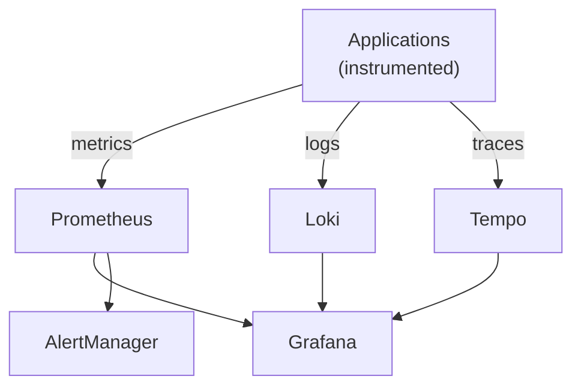

# Quick Start Guide

Get the observability stack running in 5 minutes!

## Prerequisites

- Kubernetes cluster (minikube, kind, k3s, or cloud provider)
- kubectl installed and configured
- Helm 3.x installed
- At least 8GB RAM available in cluster
- At least 50GB storage available

## Installation

### Option 1: One-Line Install (Recommended)

```bash
./scripts/install.sh
```

This script will:
- Check prerequisites
- Create the observability namespace
- Install all components via Helm
- Verify the installation
- Display access instructions

### Option 2: Manual Install

```bash
# Create namespace
kubectl create namespace observability

# Install via Helm
helm install observability ./helm/observability \
  --namespace observability \
  --values ./helm/observability/values.yaml \
  --wait

# Verify
kubectl get pods -n observability
```

### Option 3: Using Make

```bash
make install
```

## Access Dashboards

### Grafana

```bash
# Port forward
kubectl port-forward -n observability svc/grafana 3000:3000

# Visit http://localhost:3000
# Default credentials: admin/admin
```

**Important**: Change the admin password immediately!

### Prometheus

```bash
# Port forward
kubectl port-forward -n observability svc/prometheus 9090:9090

# Visit http://localhost:9090
```

### AlertManager

```bash
# Port forward
kubectl port-forward -n observability svc/alertmanager 9093:9093

# Visit http://localhost:9093
```

## Deploy Sample Application

Test the observability stack with a fully instrumented sample application:

```bash
# Deploy sample app
kubectl apply -f examples/sample-app/deployment.yaml

# Generate some traffic
kubectl run -it --rm load-test --image=busybox --restart=Never -- sh -c \
  'while true; do wget -q -O- http://sample-app/api/users; sleep 1; done'
```

Now you can:
1. View metrics in Prometheus
2. See dashboards in Grafana
3. Query logs in Loki
4. Explore traces in Tempo

## Next Steps

### 1. Configure AlertManager

Edit AlertManager config with your Slack/PagerDuty details:

```bash
kubectl edit configmap alertmanager-config -n observability
```

Update the webhook URLs and service keys, then reload:

```bash
kubectl rollout restart deployment/alertmanager -n observability
```

### 2. Import Dashboards

In Grafana:
- Go to Dashboards → Import
- Enter dashboard ID:
  - **7249** - Kubernetes Cluster Overview
  - **1860** - Node Exporter Full
  - **6417** - Kubernetes Pods
  - **13639** - Loki Dashboard

### 3. Instrument Your Applications

See examples in:
- `examples/sample-app/app.py` - Python instrumentation
- `docs/MONITORING_GUIDE.md` - Multi-language examples

## Common Commands

```bash
# Check status
kubectl get pods -n observability

# View logs
kubectl logs -f deployment/grafana -n observability
kubectl logs -f statefulset/prometheus -n observability

# Restart component
kubectl rollout restart deployment/grafana -n observability

# Scale up
kubectl scale statefulset prometheus --replicas=3 -n observability

# Check resource usage
kubectl top pods -n observability
```

## Troubleshooting

### Pods Not Starting

```bash
# Check pod status
kubectl describe pod <pod-name> -n observability

# Check events
kubectl get events -n observability --sort-by='.lastTimestamp'
```

### Cannot Access Dashboards

```bash
# Check if services exist
kubectl get svc -n observability

# Check if pods are ready
kubectl get pods -n observability

# Try different port-forward
kubectl port-forward -n observability pod/<pod-name> 3000:3000
```

### Storage Issues

```bash
# Check PVCs
kubectl get pvc -n observability

# Describe PVC for issues
kubectl describe pvc prometheus-data-prometheus-0 -n observability
```

## Uninstall

### Preserve Data

```bash
./scripts/uninstall.sh
# Choose 'yes' when asked to preserve PVCs
```

### Complete Removal

```bash
./scripts/uninstall.sh
# Choose 'no' when asked to preserve PVCs
```

Or manually:

```bash
# Remove everything including data
kubectl delete namespace observability

# Or via Helm
helm uninstall observability -n observability
kubectl delete namespace observability
```

## Production Considerations

Before going to production, review:

1. **Security**: Change default passwords, enable TLS, configure RBAC
2. **Storage**: Use appropriate storage class, configure retention
3. **Scaling**: Adjust replicas and resources based on load
4. **Alerting**: Configure proper alert receivers
5. **Backup**: Set up backup for PVCs and configurations

See detailed guides in `docs/`:
- `DEPLOYMENT.md` - Production deployment
- `SCALABILITY.md` - Scaling strategies
- `ARCHITECTURE.md` - System architecture
- `MONITORING_GUIDE.md` - Application instrumentation
- `TROUBLESHOOTING.md` - Common issues

## Architecture Overview



## Key Features

✅ **Metrics**: Prometheus + Node Exporter + kube-state-metrics
✅ **Logs**: Loki + Promtail
✅ **Traces**: Tempo with OTLP/Jaeger/Zipkin support
✅ **Visualization**: Grafana with pre-configured datasources
✅ **Alerting**: AlertManager with Slack/PagerDuty integration
✅ **Scalability**: HPA configured for auto-scaling
✅ **High Availability**: Multi-replica deployments
✅ **Security**: RBAC, Network Policies, Secret management

## Resource Requirements

### Minimum (Development)
- 3 nodes
- 8GB RAM
- 50GB storage
- 4 CPU cores

### Recommended (Production)
- 5+ nodes
- 32GB+ RAM
- 200GB+ storage
- 8+ CPU cores

## Support & Documentation

- 📚 Full documentation: `docs/`
- 🐛 Issues: Create GitHub issue
- 💬 Community: Kubernetes Slack #sig-instrumentation
- 📧 Internal: ops-team@company.com

## License

MIT License - See LICENSE file for details

---

**Happy Monitoring! 🎉**

For detailed information, see the comprehensive guides in the `docs/` directory.

