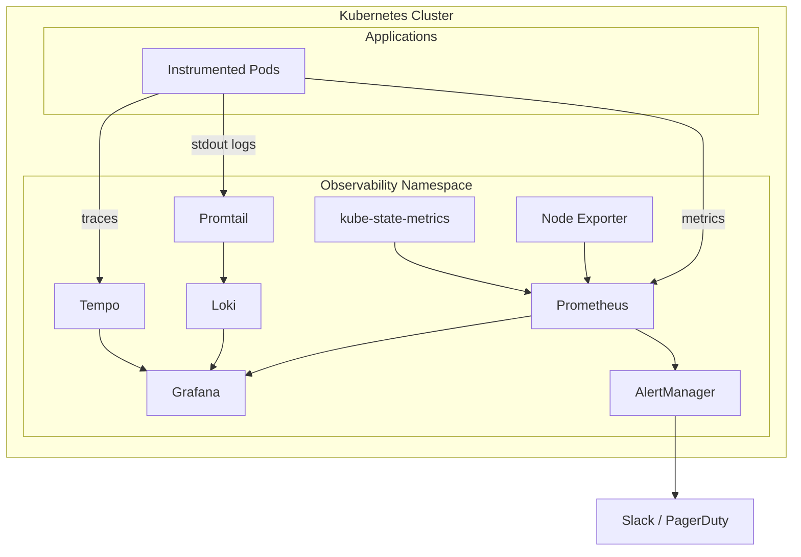
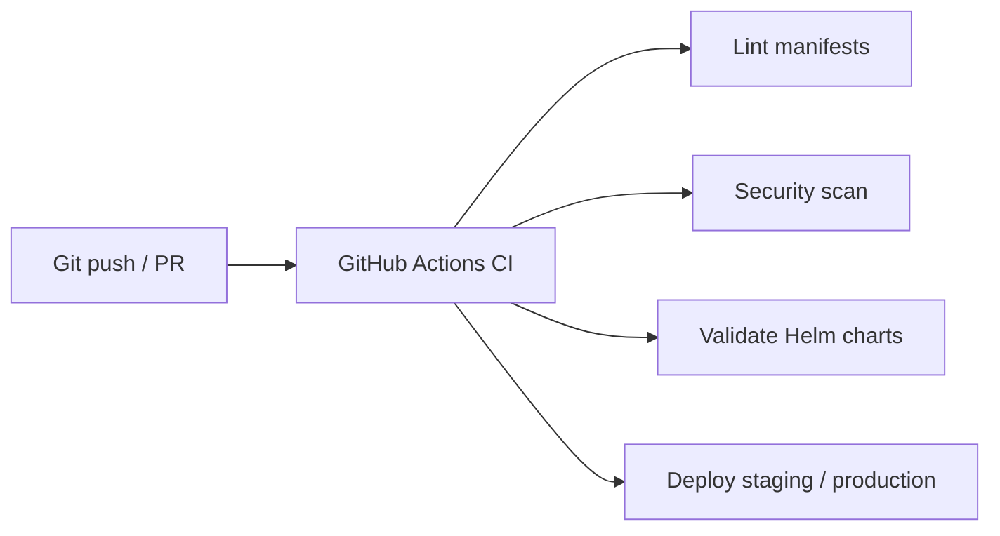

# Kubernetes Observability Platform

A comprehensive observability solution for Kubernetes clusters, including metrics, logs, traces, and alerting.

## 🏗️ Architecture Overview

This platform provides a complete observability stack:

- **Metrics**: Prometheus + Node Exporter + kube-state-metrics
- **Visualization**: Grafana with pre-configured dashboards
- **Logs**: Loki + Promtail
- **Traces**: Tempo
- **Alerting**: AlertManager with Slack/PagerDuty integration
- **Service Mesh Observability**: Support for Istio/Linkerd metrics



## 📋 Components

### Monitoring Stack
- **Prometheus**: Time-series database for metrics collection
- **Grafana**: Visualization and dashboards
- **Node Exporter**: Hardware and OS metrics
- **kube-state-metrics**: Kubernetes object metrics
- **AlertManager**: Alert routing and notification

### Logging Stack
- **Loki**: Log aggregation system
- **Promtail**: Log collection agent

### Tracing Stack
- **Tempo**: Distributed tracing backend

## 🚀 Quick Start

### Prerequisites
- Kubernetes cluster (v1.24+)
- kubectl configured
- Helm 3.x
- 16GB+ available memory
- 50GB+ storage

### Installation

#### Option 1: Using Helm (Recommended)
```bash
# Add namespaces
kubectl create namespace observability

# Install the complete stack
helm install observability ./helm/observability \
  --namespace observability \
  --values ./helm/observability/values.yaml
```

#### Option 2: Using kubectl
```bash
# Deploy using Kustomize
kubectl apply -k ./k8s/overlays/production
```

### Access Dashboards

```bash
# Grafana (default credentials: admin/admin)
kubectl port-forward -n observability svc/grafana 3000:3000

# Prometheus
kubectl port-forward -n observability svc/prometheus 9090:9090

# AlertManager
kubectl port-forward -n observability svc/alertmanager 9093:9093
```

## 📊 Key Features

### Auto-Scaling
- Horizontal Pod Autoscaling (HPA) configured for all components
- Vertical Pod Autoscaling (VPA) recommendations
- Cluster Autoscaler integration

### High Availability
- Multi-replica deployments for critical components
- Pod Disruption Budgets (PDB)
- Anti-affinity rules for pod distribution

### Security
- RBAC policies
- Network policies
- Secret management
- TLS/SSL support

### Monitoring Capabilities
- Cluster health metrics
- Node resource utilization
- Pod performance metrics
- Network traffic analysis
- Storage metrics
- Custom application metrics

## 🔧 Configuration

### Prometheus Configuration
Edit `k8s/base/prometheus/config.yaml` to add custom scrape configs.

### Grafana Dashboards
Pre-configured dashboards:
- Kubernetes Cluster Overview
- Node Metrics
- Pod Resources
- Persistent Volume Usage
- Network Traffic
- Application Performance

### Alert Rules
Configure alerts in `k8s/base/prometheus/rules/`

### Storage Configuration
Default storage class used. Modify PVC in:
- `k8s/base/prometheus/statefulset.yaml`
- `k8s/base/loki/statefulset.yaml`
- `k8s/base/grafana/deployment.yaml`

## 🔄 CI/CD Pipeline



Automated deployment using GitHub Actions:
- Lint Kubernetes manifests
- Validate Helm charts
- Security scanning
- Automated deployment to staging/production

## 📈 Scalability

### Resource Limits
All components have defined resource requests/limits:
- **Prometheus**: 2Gi-8Gi memory, 1-4 CPU cores
- **Grafana**: 256Mi-1Gi memory, 100m-500m CPU
- **Loki**: 1Gi-4Gi memory, 500m-2 CPU cores

### Storage Scaling
- Prometheus: 50Gi default (expandable)
- Loki: 50Gi default (expandable)
- Retention: 15 days (configurable)

### Horizontal Scaling
HPA configured based on:
- CPU utilization (70% threshold)
- Memory utilization (80% threshold)
- Custom metrics (request rate, query latency)

## 🔐 Security Best Practices

1. Change default Grafana credentials
2. Enable TLS for all components
3. Use secret management (Sealed Secrets/External Secrets)
4. Implement network policies
5. Regular security updates

## 📝 Monitoring Your Applications

### Exposing Metrics
```python
# Python example
from prometheus_client import Counter, Histogram
import time

REQUEST_COUNT = Counter('app_requests_total', 'Total requests')
REQUEST_LATENCY = Histogram('app_request_duration_seconds', 'Request latency')

@REQUEST_LATENCY.time()
def handle_request():
    REQUEST_COUNT.inc()
    # Your code here
```

### Service Monitor
```yaml
apiVersion: monitoring.coreos.com/v1
kind: ServiceMonitor
metadata:
  name: my-app
spec:
  selector:
    matchLabels:
      app: my-app
  endpoints:
  - port: metrics
    interval: 30s
```

## 🔍 Troubleshooting

### Prometheus Not Scraping Targets
```bash
# Check service discovery
kubectl get servicemonitors -n observability

# View Prometheus logs
kubectl logs -n observability deployment/prometheus -f
```

### High Memory Usage
```bash
# Reduce retention period
# Reduce scrape frequency
# Implement recording rules
```

### Grafana Dashboard Issues
```bash
# Verify data source connection
# Check Prometheus connectivity
# Review query syntax
```

## 📚 Additional Resources

- [Prometheus Documentation](https://prometheus.io/docs/)
- [Grafana Documentation](https://grafana.com/docs/)
- [Loki Documentation](https://grafana.com/docs/loki/)
- [Kubernetes Monitoring Best Practices](https://kubernetes.io/docs/tasks/debug/)

## 🤝 Contributing

1. Fork the repository
2. Create feature branch
3. Commit changes
4. Push to branch
5. Create Pull Request

## 📄 License

MIT License

## 🆘 Support

For issues and questions:
- GitHub Issues
- Internal Slack: #observability
- Email: ops-team@company.com

