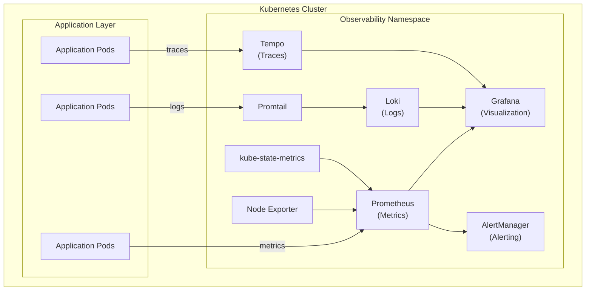
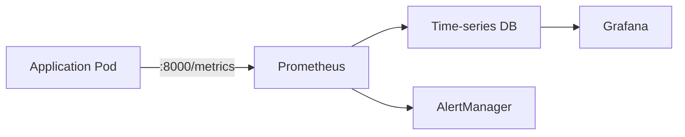
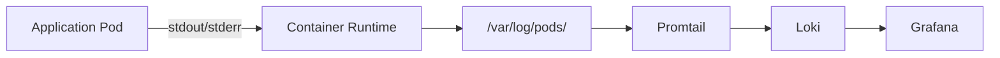
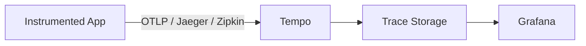
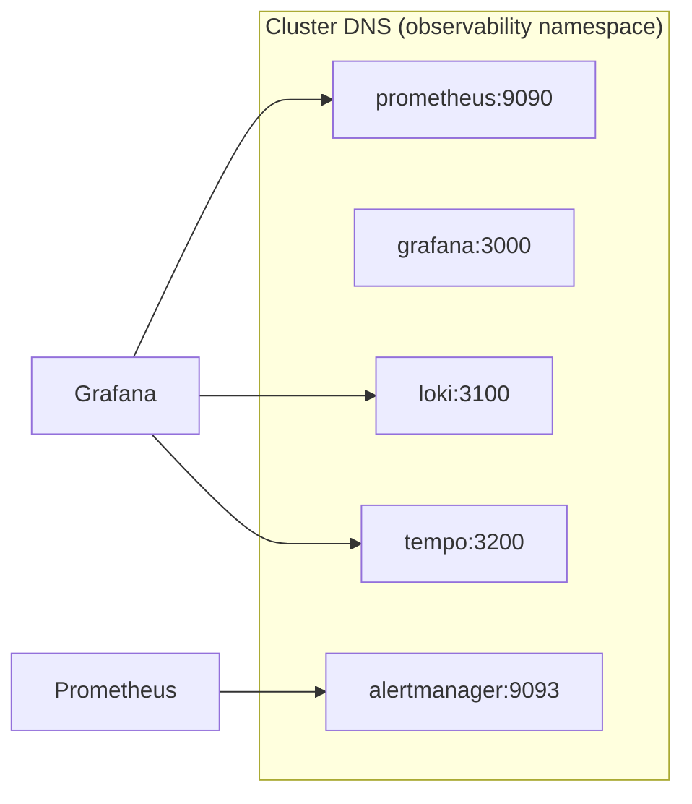
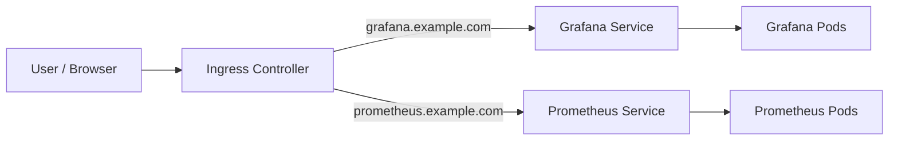
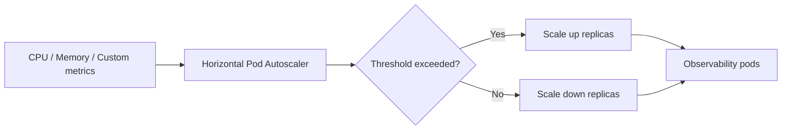
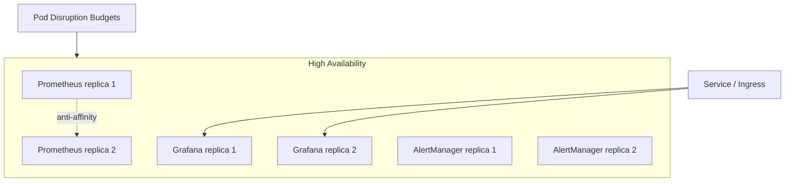

# Architecture Overview

This document describes the architecture of the Kubernetes observability platform.

## System Architecture

## Components

### 1. Prometheus

**Purpose**: Time-series database for metrics collection and storage

**Architecture**:

- StatefulSet deployment with 2+ replicas
- Persistent volume for data storage (50Gi default)
- Service discovery for Kubernetes resources
- Remote write capability for long-term storage

**Key Features**:

- Pull-based metrics collection
- PromQL query language
- Recording rules for aggregation
- Alert rule evaluation
- Federation for multi-cluster setup

**Resource Requirements**:

- CPU: 500m - 2000m
- Memory: 2Gi - 8Gi
- Storage: 50Gi (expandable)

**High Availability**:

- Multiple replicas with pod anti-affinity
- Each replica scrapes all targets
- Deduplication handled by query layer

### 2. Grafana

**Purpose**: Visualization and dashboard platform

**Architecture**:

- Deployment with 2+ replicas
- Persistent volume for dashboard storage
- ConfigMap-based datasource provisioning
- Dashboard provisioning via ConfigMaps

**Key Features**:

- Multiple datasource support
- Rich visualization options
- Alerting (complementary to Prometheus)
- Plugin ecosystem
- User management and RBAC

**Resource Requirements**:

- CPU: 100m - 500m
- Memory: 256Mi - 1Gi
- Storage: 10Gi

**Data Sources**:

- Prometheus (metrics)
- Loki (logs)
- Tempo (traces)

### 3. Loki

**Purpose**: Log aggregation system

**Architecture**:

- StatefulSet deployment
- Persistent volume for log storage
- Index in BoltDB
- Chunks in filesystem (or object storage)

**Key Features**:

- Label-based indexing (not full-text)
- LogQL query language
- Grafana integration
- Low storage footprint
- Horizontal scalability

**Resource Requirements**:

- CPU: 500m - 2000m
- Memory: 1Gi - 4Gi
- Storage: 50Gi (expandable)

**Components**:

- Distributor: Receives logs from agents
- Ingester: Builds chunks and indexes
- Querier: Handles LogQL queries
- Compactor: Maintains indexes

### 4. Tempo

**Purpose**: Distributed tracing backend

**Architecture**:

- StatefulSet deployment
- Persistent volume for trace storage
- Support for multiple trace formats

**Key Features**:

- Jaeger, Zipkin, OTLP compatibility
- Low operational overhead
- Grafana integration
- Service graph generation
- Trace to logs correlation

**Resource Requirements**:

- CPU: 500m - 1000m
- Memory: 1Gi - 2Gi
- Storage: 30Gi

**Protocols Supported**:

- OTLP (gRPC and HTTP)
- Jaeger (gRPC and Thrift)
- Zipkin

### 5. AlertManager

**Purpose**: Alert routing and notification management

**Architecture**:

- Deployment with 2+ replicas
- Clustering for HA
- Persistent volume for notification state

**Key Features**:

- Grouping and deduplication
- Routing to multiple receivers
- Silencing and inhibition
- Integration with PagerDuty, Slack, email, etc.

**Resource Requirements**:

- CPU: 100m - 500m
- Memory: 128Mi - 512Mi
- Storage: 5Gi

### 6. Node Exporter

**Purpose**: Hardware and OS metrics collection

**Architecture**:

- DaemonSet (runs on every node)
- Host network and PID namespace access
- No persistent storage required

**Metrics Collected**:

- CPU usage
- Memory usage
- Disk I/O
- Network statistics
- Filesystem usage

**Resource Requirements**:

- CPU: 100m - 200m
- Memory: 128Mi - 256Mi

### 7. kube-state-metrics

**Purpose**: Kubernetes object state metrics

**Architecture**:

- Deployment (single replica sufficient)
- Watches Kubernetes API
- Generates metrics about K8s objects

**Metrics Exposed**:

- Pod status and resource requests/limits
- Deployment status
- Node status
- PersistentVolume status
- ResourceQuota usage

**Resource Requirements**:

- CPU: 100m - 200m
- Memory: 128Mi - 256Mi

### 8. Promtail

**Purpose**: Log collection agent

**Architecture**:

- DaemonSet (runs on every node)
- Accesses host filesystem
- Pushes logs to Loki

**Key Features**:

- Service discovery for pods
- Label extraction
- Multi-tenancy support
- Pipeline stages for log processing

**Resource Requirements**:

- CPU: 100m - 200m
- Memory: 128Mi - 256Mi

## Data Flow

### Metrics Flow

### Logs Flow

### Traces Flow

## Network Architecture

### Service Communication

### Ingress (Optional)

## Storage Architecture

### Persistent Volumes

| Component    | Size | Access Mode   | Storage Class |
| ------------ | ---- | ------------- | ------------- |
| Prometheus   | 50Gi | ReadWriteOnce | default/fast  |
| Loki         | 50Gi | ReadWriteOnce | default/fast  |
| Tempo        | 30Gi | ReadWriteOnce | default/fast  |
| Grafana      | 10Gi | ReadWriteOnce | default       |
| AlertManager | 5Gi  | ReadWriteOnce | default       |

### Storage Considerations

1. **Prometheus**: Fast SSD recommended for queries
2. **Loki**: Can use object storage (S3, GCS) for chunks
3. **Tempo**: Can use object storage for traces
4. **Retention**: Balance between cost and compliance

## Scalability

### Horizontal Scaling

**Prometheus**:

- Scale up to 5 replicas with HPA
- Each replica scrapes all targets
- Use federation for large deployments

**Grafana**:

- Scale up to 4-6 replicas
- Stateless (with external DB)
- Load balanced

**Loki**:

- Microservices mode for large scale
- Separate ingester, distributor, querier

**Tempo**:

- Microservices mode for large scale
- Separate components for different functions

### Vertical Scaling

Adjust resource requests/limits based on:

- Number of metrics/logs/traces
- Query load
- Retention period
- Cardinality

### Auto-Scaling

HPA configured for:

- CPU utilization (70% threshold)
- Memory utilization (80% threshold)
- Custom metrics (query latency, etc.)

## High Availability

### Redundancy

- Multiple replicas for stateless components
- Pod anti-affinity rules
- Multiple availability zones

### Failure Scenarios

1. **Pod failure**: Kubernetes reschedules
2. **Node failure**: Pods moved to healthy nodes
3. **Component failure**: Other replicas serve traffic
4. **Data loss**: PV snapshots and backups

### Recovery

- Automated pod restart
- PersistentVolume retention
- Backup and restore procedures

## Security

### Authentication & Authorization

- Grafana: User/password + RBAC
- Prometheus: Basic auth (optional)
- RBAC for Kubernetes API access

### Network Security

- NetworkPolicies to restrict traffic
- TLS for inter-component communication
- Ingress with TLS termination

### Data Security

- Secrets for credentials
- RBAC for service accounts
- Pod security policies/standards

## Monitoring the Monitor

### Self-Monitoring

Prometheus monitors itself and other components:

- Component health metrics
- Resource usage metrics
- Query performance metrics

### Alerts for Observability Stack

- Prometheus target down
- High memory usage
- Storage approaching capacity
- High query latency

## Performance Considerations

### Prometheus

- Recording rules for expensive queries
- Limit cardinality
- Adjust scrape intervals
- Use external storage for long-term

### Loki

- Appropriate chunk size
- Index caching
- Query optimization
- Log parsing at ingest

### Grafana

- Dashboard query optimization
- Result caching
- Connection pooling

## Integration Points

### Service Mesh

- Istio/Linkerd metrics collection
- Service graph generation
- Distributed tracing integration

### CI/CD

- Deployment metrics
- Build success rates
- Deployment frequency

### Cloud Providers

- CloudWatch integration
- Stackdriver integration
- Azure Monitor integration

## Disaster Recovery

### Backup Strategy

- PV snapshots (hourly/daily)
- Grafana dashboard exports
- Configuration backups
- Alert rule exports

### Recovery Procedures

1. Restore PV from snapshot
2. Redeploy components
3. Import configurations
4. Verify functionality

## Future Enhancements

- Thanos for long-term storage
- Multi-cluster federation
- Advanced anomaly detection
- Cost optimization
- Service mesh deeper integration

