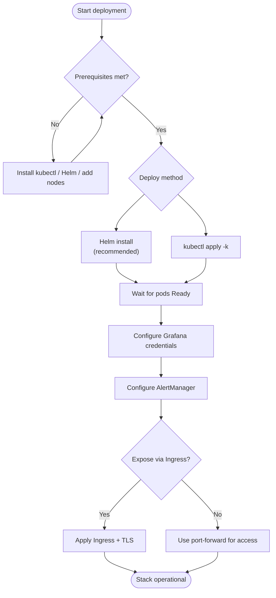
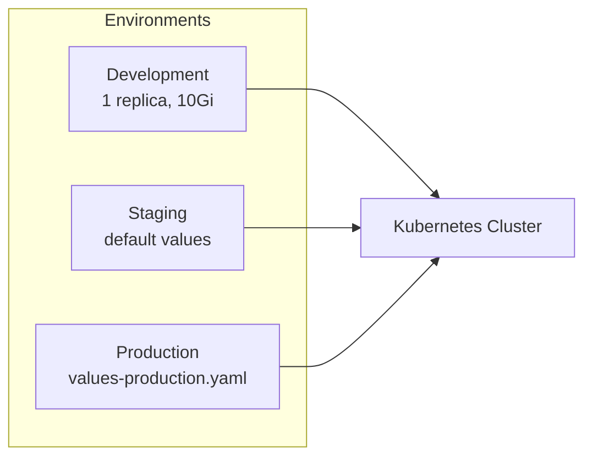

# Deployment Guide

This guide walks you through deploying the observability stack to your Kubernetes cluster.

## Deployment Flow



## Prerequisites

- Kubernetes cluster v1.24+ with at least:
  - 3 worker nodes
  - 16GB RAM per node
  - 100GB available storage
- `kubectl` configured to access your cluster
- Helm 3.x installed
- Sufficient RBAC permissions

## Quick Start

### 1. Using Helm (Recommended)

```bash
# Clone the repository
git clone <repository-url>
cd Observability

# Create namespace
kubectl create namespace observability

# Deploy with default values
helm install observability ./helm/observability \
  --namespace observability \
  --values ./helm/observability/values.yaml

# Wait for all pods to be ready
kubectl wait --for=condition=ready pod --all -n observability --timeout=600s
```

### 2. Using Kustomize

```bash
# Deploy using kustomize
kubectl apply -k ./k8s/base/

# Check deployment status
kubectl get pods -n observability
```

## Environment-Specific Deployments



### Development Environment

```bash
helm install observability ./helm/observability \
  --namespace observability \
  --values ./helm/observability/values.yaml \
  --set prometheus.replicas=1 \
  --set prometheus.storage.size=10Gi \
  --set grafana.replicas=1 \
  --set loki.storage.size=10Gi
```

### Staging Environment

```bash
helm install observability ./helm/observability \
  --namespace observability \
  --values ./helm/observability/values.yaml
```

### Production Environment

```bash
helm install observability ./helm/observability \
  --namespace observability \
  --values ./helm/observability/values.yaml \
  --values ./helm/observability/values-production.yaml
```

## Post-Deployment Configuration

### 1. Access Grafana

```bash
# Port forward to Grafana
kubectl port-forward -n observability svc/grafana 3000:3000

# Get initial password
kubectl get secret -n observability grafana-credentials \
  -o jsonpath="{.data.admin-password}" | base64 --decode

# Open browser to http://localhost:3000
```

**Important:** Change the default admin password immediately!

```bash
# Update Grafana password
kubectl create secret generic grafana-credentials \
  --from-literal=admin-user=admin \
  --from-literal=admin-password=YOUR_NEW_PASSWORD \
  --dry-run=client -o yaml | kubectl apply -f - -n observability

# Restart Grafana pods
kubectl rollout restart deployment/grafana -n observability
```

### 2. Configure AlertManager

Edit the AlertManager configuration:

```bash
kubectl edit configmap alertmanager-config -n observability
```

Update Slack webhook URL and PagerDuty keys:

```yaml
global:
  slack_api_url: 'https://hooks.slack.com/services/YOUR/ACTUAL/WEBHOOK'

receivers:
  - name: 'critical'
    pagerduty_configs:
      - service_key: 'YOUR_ACTUAL_PAGERDUTY_KEY'
```

Reload AlertManager:

```bash
kubectl rollout restart deployment/alertmanager -n observability
```

### 3. Add Custom Dashboards to Grafana

```bash
# Copy your dashboard JSON to a ConfigMap
kubectl create configmap custom-dashboard \
  --from-file=dashboard.json=/path/to/your/dashboard.json \
  -n observability

# Label it for Grafana to pick it up
kubectl label configmap custom-dashboard grafana_dashboard=1 -n observability
```

## Upgrading

### Helm Upgrade

```bash
# Upgrade to new version
helm upgrade observability ./helm/observability \
  --namespace observability \
  --values ./helm/observability/values.yaml \
  --values ./helm/observability/values-production.yaml

# Verify upgrade
kubectl rollout status statefulset/prometheus -n observability
kubectl rollout status deployment/grafana -n observability
```

### Rollback

```bash
# List releases
helm history observability -n observability

# Rollback to previous version
helm rollback observability -n observability

# Rollback to specific revision
helm rollback observability 2 -n observability
```

## Storage Configuration

### Using Cloud Provider Storage

#### AWS EBS

```yaml
prometheus:
  storage:
    storageClass: "gp3"

loki:
  storage:
    storageClass: "gp3"
```

#### GCP Persistent Disk

```yaml
prometheus:
  storage:
    storageClass: "pd-ssd"

loki:
  storage:
    storageClass: "pd-ssd"
```

#### Azure Disk

```yaml
prometheus:
  storage:
    storageClass: "managed-premium"

loki:
  storage:
    storageClass: "managed-premium"
```

### Resize PVCs

```bash
# Edit PVC
kubectl edit pvc prometheus-data-prometheus-0 -n observability

# Update size
spec:
  resources:
    requests:
      storage: 100Gi

# Verify expansion
kubectl get pvc -n observability
```

## Network Configuration

### Ingress Setup

```yaml
apiVersion: networking.k8s.io/v1
kind: Ingress
metadata:
  name: grafana-ingress
  namespace: observability
  annotations:
    cert-manager.io/cluster-issuer: "letsencrypt-prod"
    nginx.ingress.kubernetes.io/ssl-redirect: "true"
spec:
  ingressClassName: nginx
  tls:
  - hosts:
    - grafana.example.com
    secretName: grafana-tls
  rules:
  - host: grafana.example.com
    http:
      paths:
      - path: /
        pathType: Prefix
        backend:
          service:
            name: grafana
            port:
              number: 3000
```

Apply ingress:

```bash
kubectl apply -f ingress.yaml
```

## Monitoring the Monitoring Stack

### Check Component Status

```bash
# Check all pods
kubectl get pods -n observability

# Check StatefulSets
kubectl get statefulsets -n observability

# Check PVCs
kubectl get pvc -n observability

# Check services
kubectl get svc -n observability
```

### View Logs

```bash
# Prometheus logs
kubectl logs -f statefulset/prometheus -n observability

# Grafana logs
kubectl logs -f deployment/grafana -n observability

# Loki logs
kubectl logs -f statefulset/loki -n observability
```

### Check Metrics

```bash
# Port forward to Prometheus
kubectl port-forward -n observability svc/prometheus 9090:9090

# Query Prometheus metrics
curl http://localhost:9090/api/v1/query?query=up

# Check targets
curl http://localhost:9090/api/v1/targets
```

## Troubleshooting

### Pods Not Starting

```bash
# Check pod events
kubectl describe pod <pod-name> -n observability

# Check logs
kubectl logs <pod-name> -n observability

# Check resource constraints
kubectl top pods -n observability
kubectl top nodes
```

### Storage Issues

```bash
# Check PVC status
kubectl get pvc -n observability

# Check PV
kubectl get pv

# Describe PVC for events
kubectl describe pvc <pvc-name> -n observability
```

### High Memory Usage

```bash
# Reduce retention period
helm upgrade observability ./helm/observability \
  --set prometheus.retention=7d \
  --reuse-values

# Reduce replicas temporarily
kubectl scale statefulset prometheus --replicas=1 -n observability
```

### Network Issues

```bash
# Test connectivity from a pod
kubectl run -it --rm debug --image=busybox --restart=Never -- sh

# Inside the pod
wget -O- http://prometheus:9090/-/healthy
wget -O- http://loki:3100/ready
```

## Backup and Restore

### Backup Prometheus Data

```bash
# Create snapshot
kubectl exec -n observability prometheus-0 -- \
  curl -X POST http://localhost:9090/api/v1/admin/tsdb/snapshot

# Copy snapshot
kubectl cp observability/prometheus-0:/prometheus/snapshots ./backup/
```

### Backup Grafana Dashboards

```bash
# Export all dashboards
kubectl port-forward -n observability svc/grafana 3000:3000 &

# Use Grafana API to export
curl -H "Authorization: Bearer YOUR_API_KEY" \
  http://localhost:3000/api/search?query=& | \
  jq -r '.[] | .uid' | \
  xargs -I {} curl -H "Authorization: Bearer YOUR_API_KEY" \
  http://localhost:3000/api/dashboards/uid/{} > dashboard_{}.json
```

## Uninstallation

### Using Helm

```bash
# Uninstall release
helm uninstall observability -n observability

# Delete namespace (will delete all resources including PVCs)
kubectl delete namespace observability
```

### Preserve Data

```bash
# Uninstall but keep PVCs
helm uninstall observability -n observability

# Delete other resources but keep PVCs
kubectl delete all --all -n observability

# PVCs will remain for future use
kubectl get pvc -n observability
```

## Advanced Configuration

### Enable HTTPS/TLS

1. Create TLS secret:

```bash
kubectl create secret tls grafana-tls \
  --cert=path/to/tls.crt \
  --key=path/to/tls.key \
  -n observability
```

2. Update Grafana configuration to use TLS

### Integrate with Service Mesh

For Istio:

```bash
# Label namespace for sidecar injection
kubectl label namespace observability istio-injection=enabled

# Restart pods
kubectl rollout restart deployment -n observability
kubectl rollout restart statefulset -n observability
```

### Multi-Cluster Setup

Deploy Thanos for multi-cluster Prometheus:

```bash
# Deploy Thanos sidecar with Prometheus
# Configure remote write to central Thanos Query
```

## Performance Tuning

### Optimize Prometheus

```yaml
# Recording rules for frequently queried metrics
# Reduce cardinality
# Adjust scrape intervals
# Use external labels for federation
```

### Optimize Loki

```yaml
# Adjust chunk size
# Configure compaction
# Use object storage for chunks
# Enable caching
```

## Security Hardening

1. **Network Policies**: Restrict traffic between components
2. **Pod Security Policies**: Enforce security standards
3. **RBAC**: Limit service account permissions
4. **Secret Management**: Use external secret managers
5. **TLS**: Enable encryption for all communications

## Support

For issues and questions:
- GitHub Issues: <repository-url>/issues
- Internal Docs: <wiki-url>
- Team Slack: #observability

