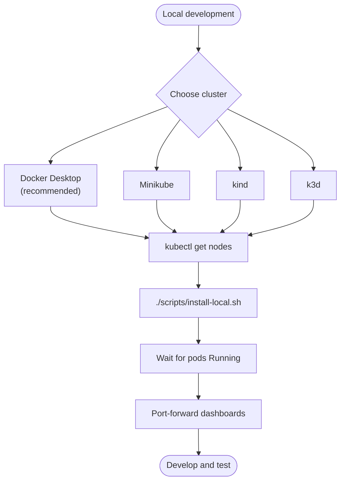
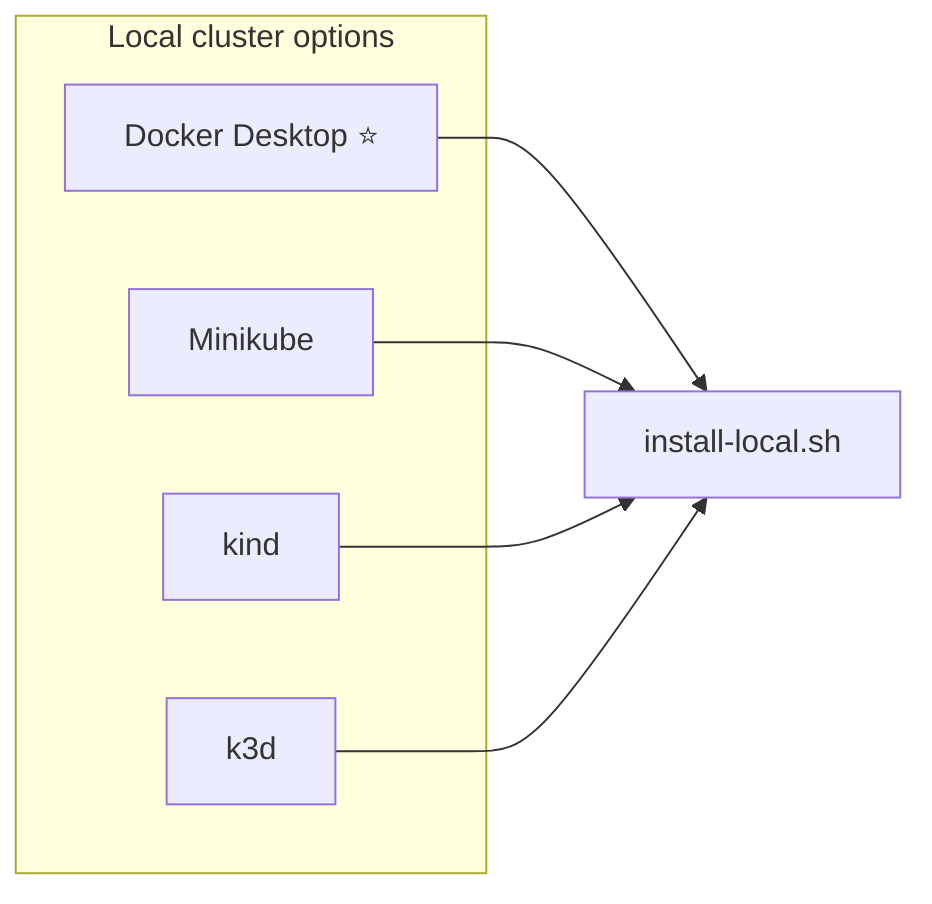

# Local Development Setup

Complete guide to run the observability stack on your local machine.

## Local Setup Flow



## Prerequisites

### Option 1: Docker Desktop (Easiest for Mac)
1. Install [Docker Desktop for Mac](https://www.docker.com/products/docker-desktop/)
2. Enable Kubernetes:
   - Open Docker Desktop → Settings → Kubernetes
   - Check "Enable Kubernetes"
   - Click "Apply & Restart"
   - Wait for Kubernetes to start (green indicator)

### Option 2: Minikube
```bash
# Install minikube
brew install minikube

# Start cluster with sufficient resources
minikube start --cpus=4 --memory=8192 --disk-size=50g

# Verify
kubectl cluster-info
```

### Option 3: kind (Kubernetes in Docker)
```bash
# Install kind
brew install kind

# Create cluster
kind create cluster --name observability --config - <<EOF
kind: Cluster
apiVersion: kind.x-k8s.io/v1alpha4
nodes:
- role: control-plane
- role: worker
- role: worker
EOF

# Verify
kubectl cluster-info
```

### Option 4: k3d (Lightweight k3s)
```bash
# Install k3d
brew install k3d

# Create cluster
k3d cluster create observability --agents 2 --servers 1

# Verify
kubectl cluster-info
```

## Recommended for Local: Docker Desktop

For local development, **Docker Desktop with Kubernetes** is the simplest and most stable option.



## Installation Steps

### 1. Verify Cluster is Running

```bash
kubectl get nodes
# Should show at least 1 node in Ready state
```

### 2. Install Observability Stack

```bash
cd /Users/rohtash/MySpace/Services/Infrastructure/Observability

# Use the local install script
./scripts/install-local.sh
```

This will install:
- ✅ Prometheus (with reduced resources for local)
- ✅ Grafana
- ✅ Loki
- ✅ Tempo
- ✅ AlertManager
- ✅ Node Exporter (works on local clusters)
- ✅ kube-state-metrics
- ✅ Promtail (works on local clusters)

### 3. Wait for Installation

The installation takes about 5-10 minutes. Watch the progress:

```bash
kubectl get pods -n observability -w
```

Press `Ctrl+C` when all pods show `Running` and `1/1` or `2/2` ready.

### 4. Access Dashboards

#### Grafana
```bash
kubectl port-forward -n observability svc/grafana 3000:3000
```
Visit: http://localhost:3000
- Username: `admin`
- Password: `admin` (change on first login)

#### Prometheus
```bash
kubectl port-forward -n observability svc/prometheus 9090:9090
```
Visit: http://localhost:9090

#### AlertManager
```bash
kubectl port-forward -n observability svc/alertmanager 9093:9093
```
Visit: http://localhost:9093

## Local Configuration

### Reduced Resource Requirements

The local install uses smaller resource allocations suitable for development:

| Component | Replicas | Memory | Storage |
|-----------|----------|--------|---------|
| Prometheus | 1 | 1Gi | 10Gi |
| Grafana | 1 | 256Mi | 5Gi |
| Loki | 1 | 512Mi | 10Gi |
| Tempo | 1 | 512Mi | 5Gi |
| AlertManager | 1 | 128Mi | 2Gi |

Total: ~2.5Gi RAM, ~42Gi storage

### Storage

Local clusters use:
- **Docker Desktop**: hostPath storage
- **Minikube**: hostPath storage (in VM)
- **kind**: local-path provisioner
- **k3d**: local-path provisioner

All are automatically configured and work out of the box.

## Testing the Stack

### 1. Deploy Sample Application

```bash
kubectl apply -f examples/sample-app/deployment.yaml
```

### 2. Generate Traffic

```bash
# In one terminal, start port-forward
kubectl port-forward svc/sample-app 8080:80

# In another terminal, generate traffic
while true; do
  curl http://localhost:8080/api/users
  sleep 2
done
```

### 3. View Metrics in Grafana

1. Open Grafana: http://localhost:3000
2. Go to Explore
3. Select "Prometheus" datasource
4. Try queries:
   ```promql
   rate(http_requests_total[5m])
   ```

### 4. View Logs in Loki

1. In Grafana Explore
2. Select "Loki" datasource
3. Try queries:
   ```logql
   {app="sample-app"}
   ```

### 5. View Traces in Tempo

1. In Grafana Explore
2. Select "Tempo" datasource
3. Search for service: `sample-app`

## Common Local Issues

### Issue: Pods Pending (Insufficient Resources)

```bash
# Check node resources
kubectl describe nodes

# Solution: Increase Docker Desktop resources
# Docker Desktop → Settings → Resources
# Set: CPU: 4, Memory: 8GB
```

### Issue: ImagePullBackOff

```bash
# Check events
kubectl get events -n observability --sort-by='.lastTimestamp'

# Usually means Docker Hub rate limit
# Wait a few minutes and try again
```

### Issue: PVCs Pending

```bash
# Check PVCs
kubectl get pvc -n observability

# For Docker Desktop - ensure enough disk space allocated
# Docker Desktop → Settings → Resources → Disk image size
```

### Issue: Port Already in Use

```bash
# If port-forward fails with "address already in use"
# Find and kill the process
lsof -ti:3000 | xargs kill -9

# Or use different port
kubectl port-forward -n observability svc/grafana 3001:3000
```

## Stopping and Starting

### Stop Everything (Keep Data)

```bash
# Just stop port-forwards (Ctrl+C)
# Cluster keeps running in background
```

### Uninstall Stack (Keep Cluster)

```bash
./scripts/uninstall.sh
# Choose "yes" to preserve data
```

### Stop Cluster

```bash
# Docker Desktop: Just quit Docker Desktop
# Minikube: minikube stop
# kind: kind delete cluster --name observability
# k3d: k3d cluster stop observability
```

### Restart Everything

```bash
# Docker Desktop: Start Docker Desktop, enable Kubernetes
# Minikube: minikube start
# kind: kind create cluster --name observability
# k3d: k3d cluster start observability

# Stack will auto-start if installed
kubectl get pods -n observability
```

## Development Workflow

### Quick Access Script

Create `~/.zshrc` or `~/.bashrc` aliases:

```bash
# Add to your shell config
alias obs-grafana='kubectl port-forward -n observability svc/grafana 3000:3000'
alias obs-prometheus='kubectl port-forward -n observability svc/prometheus 9090:9090'
alias obs-status='kubectl get pods -n observability'
alias obs-logs='kubectl logs -n observability -f'
```

Then just run:
```bash
obs-grafana
obs-status
```

### Multiple Port Forwards at Once

Create a script `scripts/port-forward-all.sh`:
```bash
#!/bin/bash
kubectl port-forward -n observability svc/grafana 3000:3000 &
kubectl port-forward -n observability svc/prometheus 9090:9090 &
kubectl port-forward -n observability svc/alertmanager 9093:9093 &

echo "Port forwards started!"
echo "Grafana: http://localhost:3000"
echo "Prometheus: http://localhost:9090"
echo "AlertManager: http://localhost:9093"
echo ""
echo "Press Ctrl+C to stop all"

wait
```

### Live Development

To test changes without reinstalling:

```bash
# Apply single component changes
kubectl apply -f k8s/base/prometheus/configmap.yaml

# Restart component to pick up changes
kubectl rollout restart statefulset/prometheus -n observability

# Watch restart
kubectl rollout status statefulset/prometheus -n observability
```

## Performance Tips

### 1. Reduce Scrape Frequency for Local

Edit Prometheus config for longer intervals:
```yaml
global:
  scrape_interval: 30s  # Instead of 15s
```

### 2. Reduce Retention

```yaml
prometheus:
  retention: 3d  # Instead of 15d
```

### 3. Disable HPA for Local

```bash
kubectl delete hpa --all -n observability
```

### 4. Single Replicas

Local doesn't need HA:
```yaml
prometheus:
  replicas: 1
grafana:
  replicas: 1
```

## Next Steps

Once everything works locally:

1. **Test your applications**: Deploy and instrument your own apps
2. **Create custom dashboards**: Practice building Grafana dashboards
3. **Test alerting**: Configure and test alert rules
4. **Learn queries**: Practice PromQL and LogQL
5. **Deploy to staging**: Use production configs on real cluster

## Clean Up Completely

To remove everything and start fresh:

```bash
# Uninstall stack
./scripts/uninstall.sh

# Delete cluster
# Docker Desktop: Disable Kubernetes, re-enable
# Minikube: minikube delete
# kind: kind delete cluster --name observability
# k3d: k3d cluster delete observability
```

## Troubleshooting

### Get All Logs

```bash
# Save all logs for debugging
for pod in $(kubectl get pods -n observability -o name); do
  kubectl logs -n observability $pod > "${pod}.log"
done
```

### Check Resource Usage

```bash
# Node resources
kubectl top nodes

# Pod resources
kubectl top pods -n observability

# Describe nodes
kubectl describe nodes
```

### Reset Everything

```bash
# Delete namespace (removes everything)
kubectl delete namespace observability

# Wait for cleanup
kubectl wait --for=delete namespace/observability --timeout=60s

# Reinstall
./scripts/install-local.sh
```

## Recommended: Docker Desktop Configuration

For the best local experience:

**Settings → Resources:**
- CPUs: 4 (minimum)
- Memory: 8GB (minimum)
- Swap: 2GB
- Disk: 60GB

**Settings → Kubernetes:**
- Enable Kubernetes: ✓
- Show system containers: ✓

This provides enough resources for the full observability stack plus your applications.

## Success Criteria

You know it's working when:

✅ All pods in `observability` namespace are Running
✅ Grafana loads at http://localhost:3000
✅ Prometheus shows targets as UP
✅ Sample app metrics appear in Prometheus
✅ Sample app logs appear in Loki
✅ Sample app traces appear in Tempo

Now you're ready to develop and test locally! 🚀

