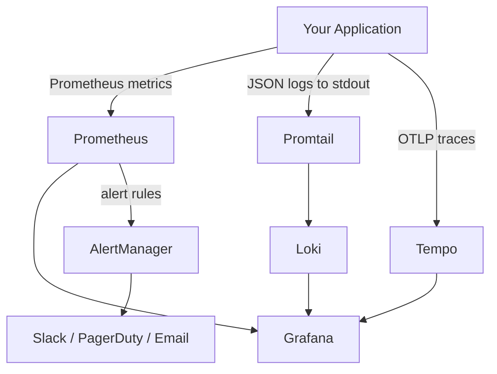
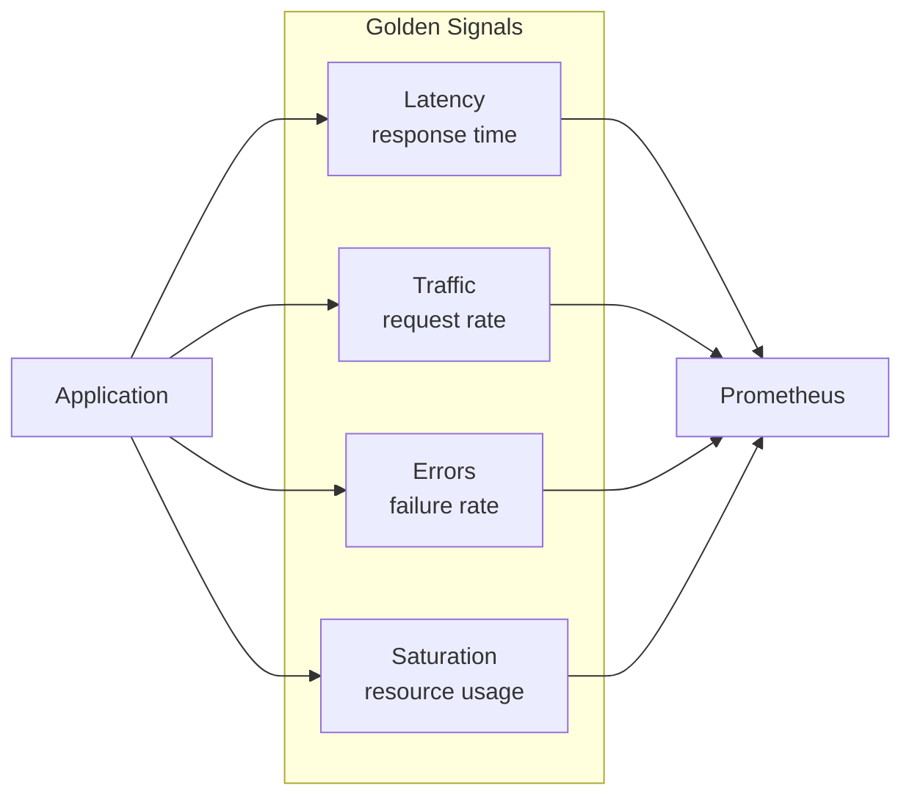

# Monitoring Guide

Complete guide for monitoring your applications and infrastructure with the observability stack.

## Table of Contents

- [Instrumenting Applications](#instrumenting-applications)
- [Key Metrics to Monitor](#key-metrics-to-monitor)
- [Creating Dashboards](#creating-dashboards)
- [Setting Up Alerts](#setting-up-alerts)
- [Log Management](#log-management)
- [Distributed Tracing](#distributed-tracing)

## Observability Data Flow



## Instrumenting Applications

### Exposing Metrics

#### Python Application

```python
from prometheus_client import Counter, Histogram, Gauge, start_http_server
import time
import random

# Define metrics
REQUEST_COUNT = Counter(
    'app_requests_total',
    'Total app requests',
    ['method', 'endpoint', 'status']
)

REQUEST_LATENCY = Histogram(
    'app_request_duration_seconds',
    'Request latency',
    ['method', 'endpoint']
)

ACTIVE_CONNECTIONS = Gauge(
    'app_active_connections',
    'Active connections'
)

# Use in your application
@REQUEST_LATENCY.labels(method='GET', endpoint='/api/users').time()
def get_users():
    ACTIVE_CONNECTIONS.inc()
    try:
        # Your business logic
        result = process_request()
        REQUEST_COUNT.labels(method='GET', endpoint='/api/users', status='200').inc()
        return result
    except Exception as e:
        REQUEST_COUNT.labels(method='GET', endpoint='/api/users', status='500').inc()
        raise
    finally:
        ACTIVE_CONNECTIONS.dec()

# Start metrics server
if __name__ == '__main__':
    start_http_server(8000)
    # Your application code
```

#### Go Application

```go
package main

import (
    "github.com/prometheus/client_golang/prometheus"
    "github.com/prometheus/client_golang/prometheus/promhttp"
    "net/http"
    "time"
)

var (
    requestCounter = prometheus.NewCounterVec(
        prometheus.CounterOpts{
            Name: "app_requests_total",
            Help: "Total app requests",
        },
        []string{"method", "endpoint", "status"},
    )

    requestDuration = prometheus.NewHistogramVec(
        prometheus.HistogramOpts{
            Name: "app_request_duration_seconds",
            Help: "Request duration in seconds",
            Buckets: prometheus.DefBuckets,
        },
        []string{"method", "endpoint"},
    )

    activeConnections = prometheus.NewGauge(
        prometheus.GaugeOpts{
            Name: "app_active_connections",
            Help: "Active connections",
        },
    )
)

func init() {
    prometheus.MustRegister(requestCounter)
    prometheus.MustRegister(requestDuration)
    prometheus.MustRegister(activeConnections)
}

func handleRequest(w http.ResponseWriter, r *http.Request) {
    start := time.Now()
    activeConnections.Inc()
    defer activeConnections.Dec()

    // Your business logic
    status := "200"
    
    duration := time.Since(start).Seconds()
    requestDuration.WithLabelValues(r.Method, r.URL.Path).Observe(duration)
    requestCounter.WithLabelValues(r.Method, r.URL.Path, status).Inc()
}

func main() {
    http.Handle("/metrics", promhttp.Handler())
    http.HandleFunc("/api/users", handleRequest)
    http.ListenAndServe(":8080", nil)
}
```

#### Node.js Application

```javascript
const express = require('express');
const prometheus = require('prom-client');

// Create metrics
const requestCounter = new prometheus.Counter({
  name: 'app_requests_total',
  help: 'Total app requests',
  labelNames: ['method', 'endpoint', 'status']
});

const requestDuration = new prometheus.Histogram({
  name: 'app_request_duration_seconds',
  help: 'Request duration',
  labelNames: ['method', 'endpoint']
});

const activeConnections = new prometheus.Gauge({
  name: 'app_active_connections',
  help: 'Active connections'
});

// Middleware
const metricsMiddleware = (req, res, next) => {
  const start = Date.now();
  activeConnections.inc();
  
  res.on('finish', () => {
    const duration = (Date.now() - start) / 1000;
    requestDuration.labels(req.method, req.path).observe(duration);
    requestCounter.labels(req.method, req.path, res.statusCode).inc();
    activeConnections.dec();
  });
  
  next();
};

const app = express();
app.use(metricsMiddleware);

// Metrics endpoint
app.get('/metrics', async (req, res) => {
  res.set('Content-Type', prometheus.register.contentType);
  res.end(await prometheus.register.metrics());
});

app.listen(8080);
```

### Kubernetes Configuration

#### ServiceMonitor for Prometheus Operator

```yaml
apiVersion: monitoring.coreos.com/v1
kind: ServiceMonitor
metadata:
  name: my-app
  namespace: default
spec:
  selector:
    matchLabels:
      app: my-app
  endpoints:
  - port: metrics
    interval: 30s
    path: /metrics
```

#### Pod Annotations for Scraping

```yaml
apiVersion: v1
kind: Pod
metadata:
  name: my-app
  annotations:
    prometheus.io/scrape: "true"
    prometheus.io/port: "8000"
    prometheus.io/path: "/metrics"
spec:
  containers:
  - name: my-app
    image: my-app:latest
    ports:
    - name: metrics
      containerPort: 8000
```

## Key Metrics to Monitor

### Golden Signals Overview



### Application Metrics

#### Golden Signals

1. **Latency** - Response time
```promql
histogram_quantile(0.95, 
  rate(app_request_duration_seconds_bucket[5m])
)
```

2. **Traffic** - Request rate
```promql
rate(app_requests_total[5m])
```

3. **Errors** - Error rate
```promql
rate(app_requests_total{status=~"5.."}[5m])
```

4. **Saturation** - Resource utilization
```promql
app_active_connections / app_max_connections * 100
```

#### RED Method (for services)

- **Rate**: Requests per second
- **Errors**: Failed requests per second  
- **Duration**: Time per request

### Infrastructure Metrics

#### Node Metrics

```promql
# CPU Usage
100 - (avg by (instance) (rate(node_cpu_seconds_total{mode="idle"}[5m])) * 100)

# Memory Usage
(node_memory_MemTotal_bytes - node_memory_MemAvailable_bytes) / node_memory_MemTotal_bytes * 100

# Disk Usage
(node_filesystem_size_bytes - node_filesystem_avail_bytes) / node_filesystem_size_bytes * 100

# Network Traffic
rate(node_network_receive_bytes_total[5m])
rate(node_network_transmit_bytes_total[5m])
```

#### Pod Metrics

```promql
# Pod CPU Usage
sum(rate(container_cpu_usage_seconds_total{container!=""}[5m])) by (pod, namespace)

# Pod Memory Usage
sum(container_memory_working_set_bytes{container!=""}) by (pod, namespace)

# Pod Restart Count
kube_pod_container_status_restarts_total

# Pod Status
kube_pod_status_phase
```

## Creating Dashboards

### Grafana Dashboard JSON

```json
{
  "dashboard": {
    "title": "Application Overview",
    "panels": [
      {
        "title": "Request Rate",
        "targets": [
          {
            "expr": "sum(rate(app_requests_total[5m])) by (endpoint)",
            "legendFormat": "{{endpoint}}"
          }
        ],
        "type": "graph"
      },
      {
        "title": "Error Rate",
        "targets": [
          {
            "expr": "sum(rate(app_requests_total{status=~\"5..\"}[5m])) by (endpoint)",
            "legendFormat": "{{endpoint}}"
          }
        ],
        "type": "graph"
      },
      {
        "title": "P95 Latency",
        "targets": [
          {
            "expr": "histogram_quantile(0.95, sum(rate(app_request_duration_seconds_bucket[5m])) by (le, endpoint))",
            "legendFormat": "{{endpoint}}"
          }
        ],
        "type": "graph"
      }
    ]
  }
}
```

### Import Existing Dashboards

Popular dashboard IDs from grafana.com:

- **Kubernetes Cluster**: 7249
- **Node Exporter Full**: 1860
- **Kubernetes Pods**: 6417
- **Prometheus Stats**: 3662
- **Loki Dashboard**: 13639

Import via Grafana UI: Dashboards → Import → Enter ID

## Setting Up Alerts

### PrometheusRule Custom Resource

```yaml
apiVersion: monitoring.coreos.com/v1
kind: PrometheusRule
metadata:
  name: app-alerts
  namespace: observability
spec:
  groups:
  - name: application
    interval: 30s
    rules:
    - alert: HighErrorRate
      expr: |
        rate(app_requests_total{status=~"5.."}[5m]) > 0.05
      for: 5m
      labels:
        severity: critical
        component: application
      annotations:
        summary: "High error rate on {{ $labels.endpoint }}"
        description: "Error rate is {{ $value | humanizePercentage }}"

    - alert: HighLatency
      expr: |
        histogram_quantile(0.95,
          rate(app_request_duration_seconds_bucket[5m])
        ) > 1
      for: 10m
      labels:
        severity: warning
        component: application
      annotations:
        summary: "High latency on {{ $labels.endpoint }}"
        description: "P95 latency is {{ $value }}s"

    - alert: PodCrashLooping
      expr: |
        rate(kube_pod_container_status_restarts_total[15m]) > 0
      for: 5m
      labels:
        severity: critical
        component: kubernetes
      annotations:
        summary: "Pod {{ $labels.pod }} is crash looping"
        description: "Pod {{ $labels.pod }} in namespace {{ $labels.namespace }} has restarted {{ $value }} times"
```

### Alert Routing

Configure in AlertManager:

```yaml
route:
  receiver: 'default'
  group_by: ['alertname', 'cluster']
  group_wait: 10s
  group_interval: 10s
  repeat_interval: 12h
  routes:
  - match:
      severity: critical
    receiver: 'pagerduty'
    continue: true
  - match:
      severity: warning
    receiver: 'slack'
  - match:
      component: database
    receiver: 'db-team'

receivers:
- name: 'slack'
  slack_configs:
  - channel: '#alerts'
    title: '{{ .GroupLabels.alertname }}'
    text: '{{ range .Alerts }}{{ .Annotations.description }}{{ end }}'

- name: 'pagerduty'
  pagerduty_configs:
  - service_key: 'YOUR_SERVICE_KEY'

- name: 'db-team'
  email_configs:
  - to: 'db-team@company.com'
```

## Log Management

### Structured Logging

#### Python

```python
import logging
import json

class JSONFormatter(logging.Formatter):
    def format(self, record):
        log_obj = {
            'timestamp': self.formatTime(record),
            'level': record.levelname,
            'message': record.getMessage(),
            'module': record.module,
            'function': record.funcName,
        }
        return json.dumps(log_obj)

logger = logging.getLogger(__name__)
handler = logging.StreamHandler()
handler.setFormatter(JSONFormatter())
logger.addHandler(handler)

logger.info("User login", extra={'user_id': 123, 'ip': '192.168.1.1'})
```

### LogQL Queries

```logql
# All logs from a namespace
{namespace="production"}

# Error logs only
{namespace="production"} |= "error"

# JSON parsing
{app="my-app"} | json | level="error"

# Rate of errors
rate({app="my-app"} |= "error" [5m])

# Top 10 endpoints by request count
topk(10, 
  sum by (endpoint) (
    rate({app="my-app"} | json | __error__="" [5m])
  )
)
```

## Distributed Tracing

### Instrument with OpenTelemetry

#### Python

```python
from opentelemetry import trace
from opentelemetry.exporter.otlp.proto.grpc.trace_exporter import OTLPSpanExporter
from opentelemetry.sdk.trace import TracerProvider
from opentelemetry.sdk.trace.export import BatchSpanProcessor

# Setup
trace.set_tracer_provider(TracerProvider())
tracer = trace.get_tracer(__name__)

otlp_exporter = OTLPSpanExporter(
    endpoint="http://tempo:4317",
    insecure=True
)

trace.get_tracer_provider().add_span_processor(
    BatchSpanProcessor(otlp_exporter)
)

# Usage
with tracer.start_as_current_span("process_request"):
    with tracer.start_as_current_span("database_query"):
        # Database operation
        pass
    with tracer.start_as_current_span("external_api_call"):
        # API call
        pass
```

### Trace Queries in Grafana

1. Navigate to Explore
2. Select Tempo datasource
3. Use TraceQL:

```traceql
# Find traces with errors
{ status = error }

# Find slow traces
{ duration > 1s }

# Find traces for specific service
{ service.name = "my-service" }

# Complex query
{ service.name = "my-service" && http.status_code = 500 }
```

## Best Practices

1. **Metric Naming**: Use consistent naming conventions
2. **Label Cardinality**: Avoid high-cardinality labels
3. **Sampling**: Use sampling for high-volume traces
4. **Retention**: Balance retention vs storage costs
5. **Documentation**: Document custom metrics and their meaning
6. **Testing**: Test alerts in non-production environments
7. **SLOs**: Define and monitor Service Level Objectives

## Resources

- [Prometheus Best Practices](https://prometheus.io/docs/practices/)
- [Grafana Documentation](https://grafana.com/docs/)
- [LogQL Guide](https://grafana.com/docs/loki/latest/logql/)
- [OpenTelemetry](https://opentelemetry.io/)

