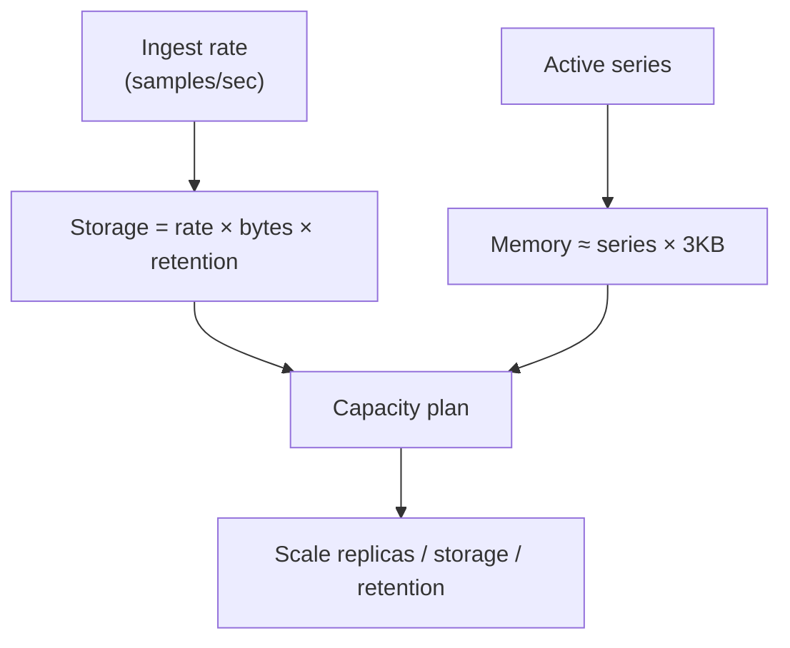
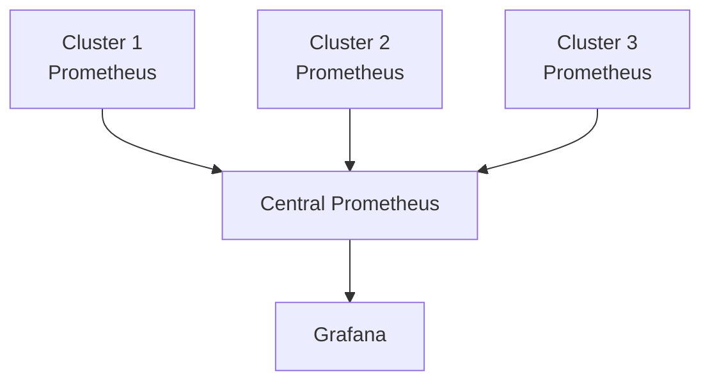
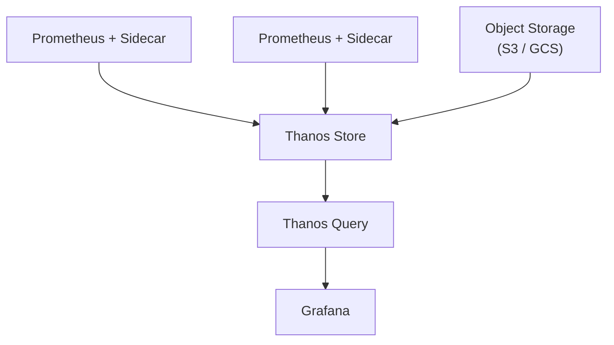

# Scalability Guide

Guidelines for scaling the observability platform to handle increased load.

## Overview

This guide covers:
- Horizontal and vertical scaling strategies
- Auto-scaling configuration
- Performance optimization
- Capacity planning
- Multi-cluster deployments

## Horizontal Scaling

### Prometheus

**Current Configuration**:
- Default: 2 replicas
- HPA: 2-5 replicas (can be adjusted)
- Production: 3-10 replicas

**Scaling Strategy**:

1. **Small Scale** (< 1000 pods)
```bash
helm upgrade observability ./helm/observability \
  --set prometheus.replicas=2 \
  --set prometheus.hpa.maxReplicas=5
```

2. **Medium Scale** (1000-5000 pods)
```bash
helm upgrade observability ./helm/observability \
  --set prometheus.replicas=3 \
  --set prometheus.hpa.maxReplicas=8 \
  --set prometheus.resources.requests.memory=4Gi \
  --set prometheus.resources.limits.memory=12Gi
```

3. **Large Scale** (> 5000 pods)
- Consider Prometheus federation
- Implement Thanos for long-term storage
- Use remote write to scale ingestion

**Federation Setup**:

```yaml
# Central Prometheus config
scrape_configs:
- job_name: 'federate'
  honor_labels: true
  metrics_path: '/federate'
  params:
    'match[]':
      - '{__name__=~"job:.*"}'  # Only federate aggregated metrics
  static_configs:
  - targets:
    - 'prometheus-cluster1:9090'
    - 'prometheus-cluster2:9090'
```

### Grafana

**Scaling Configuration**:

```bash
# Scale Grafana for high query load
helm upgrade observability ./helm/observability \
  --set grafana.replicas=4 \
  --set grafana.hpa.maxReplicas=8 \
  --set grafana.resources.requests.cpu=250m \
  --set grafana.resources.requests.memory=512Mi
```

**Database Backend** (for large deployments):

```yaml
# Use external database instead of SQLite
env:
- name: GF_DATABASE_TYPE
  value: postgres
- name: GF_DATABASE_HOST
  value: postgres.database.svc:5432
- name: GF_DATABASE_NAME
  value: grafana
- name: GF_DATABASE_USER
  valueFrom:
    secretKeyRef:
      name: grafana-db-secret
      key: username
- name: GF_DATABASE_PASSWORD
  valueFrom:
    secretKeyRef:
      name: grafana-db-secret
      key: password
```

### Loki

**Microservices Mode** (for scale):

Instead of monolithic Loki, deploy separate components:

```yaml
# Distributor - handles incoming logs
replicas: 3
resources:
  requests:
    cpu: 500m
    memory: 1Gi

# Ingester - writes to storage
replicas: 3
resources:
  requests:
    cpu: 1000m
    memory: 4Gi

# Querier - handles queries
replicas: 3
resources:
  requests:
    cpu: 500m
    memory: 2Gi

# Query Frontend - splits and caches queries
replicas: 2
resources:
  requests:
    cpu: 250m
    memory: 512Mi
```

**Object Storage Backend**:

```yaml
storage_config:
  aws:
    s3: s3://us-west-2/loki-bucket
    dynamodb:
      dynamodb_url: dynamodb://us-west-2
  
  # Or GCS
  gcs:
    bucket_name: loki-bucket
  
  # Or Azure
  azure:
    container_name: loki
    account_name: mystorageaccount
```

### Tempo

**Microservices Mode**:

```yaml
# Distributor
replicas: 3

# Ingester
replicas: 3

# Querier
replicas: 3

# Compactor
replicas: 1
```

**Object Storage**:

```yaml
storage:
  trace:
    backend: s3
    s3:
      bucket: tempo-traces
      endpoint: s3.amazonaws.com
```

## Vertical Scaling

### Resource Sizing

**Prometheus**:

| Metrics/sec | Memory | CPU | Storage (30d) |
|------------|--------|-----|---------------|
| 10K        | 4Gi    | 1   | 100Gi         |
| 50K        | 8Gi    | 2   | 500Gi         |
| 100K       | 16Gi   | 4   | 1Ti           |
| 500K       | 32Gi   | 8   | 5Ti           |

**Loki**:

| Logs MB/s | Memory | CPU | Storage (14d) |
|-----------|--------|-----|---------------|
| 10        | 2Gi    | 1   | 100Gi         |
| 50        | 4Gi    | 2   | 500Gi         |
| 100       | 8Gi    | 4   | 1Ti           |
| 500       | 16Gi   | 8   | 5Ti           |

**Tempo**:

| Spans/sec | Memory | CPU | Storage (7d) |
|-----------|--------|-----|-------------|
| 1K        | 1Gi    | 500m| 50Gi        |
| 5K        | 2Gi    | 1   | 250Gi       |
| 10K       | 4Gi    | 2   | 500Gi       |
| 50K       | 8Gi    | 4   | 2.5Ti       |

### Applying Resource Changes

```bash
# Update resource limits
helm upgrade observability ./helm/observability \
  --set prometheus.resources.requests.cpu=2000m \
  --set prometheus.resources.requests.memory=8Gi \
  --set prometheus.resources.limits.cpu=4000m \
  --set prometheus.resources.limits.memory=16Gi \
  --reuse-values
```

## Auto-Scaling

### Horizontal Pod Autoscaler (HPA)

**Metrics-based Scaling**:

```yaml
apiVersion: autoscaling/v2
kind: HorizontalPodAutoscaler
metadata:
  name: prometheus-hpa
spec:
  scaleTargetRef:
    apiVersion: apps/v1
    kind: StatefulSet
    name: prometheus
  minReplicas: 2
  maxReplicas: 10
  metrics:
  - type: Resource
    resource:
      name: cpu
      target:
        type: Utilization
        averageUtilization: 70
  - type: Resource
    resource:
      name: memory
      target:
        type: Utilization
        averageUtilization: 80
  # Custom metrics
  - type: Pods
    pods:
      metric:
        name: prometheus_http_requests_total
      target:
        type: AverageValue
        averageValue: "1000"
  behavior:
    scaleDown:
      stabilizationWindowSeconds: 300
      policies:
      - type: Percent
        value: 50
        periodSeconds: 60
    scaleUp:
      stabilizationWindowSeconds: 0
      policies:
      - type: Percent
        value: 100
        periodSeconds: 15
      - type: Pods
        value: 2
        periodSeconds: 15
```

### Vertical Pod Autoscaler (VPA)

```yaml
apiVersion: autoscaling.k8s.io/v1
kind: VerticalPodAutoscaler
metadata:
  name: prometheus-vpa
spec:
  targetRef:
    apiVersion: apps/v1
    kind: StatefulSet
    name: prometheus
  updatePolicy:
    updateMode: "Auto"  # or "Initial" or "Off"
  resourcePolicy:
    containerPolicies:
    - containerName: prometheus
      minAllowed:
        cpu: 500m
        memory: 2Gi
      maxAllowed:
        cpu: 8000m
        memory: 32Gi
      controlledResources: ["cpu", "memory"]
```

### Cluster Autoscaler

Ensure nodes scale with workload:

```yaml
# Cloud provider specific
# AWS
apiVersion: v1
kind: ConfigMap
metadata:
  name: cluster-autoscaler-priority-expander
  namespace: kube-system
data:
  priorities: |-
    10:
      - .*-observability-.*
    50:
      - .*
```

## Performance Optimization

### Prometheus Optimization

**1. Recording Rules**:

```yaml
groups:
- name: performance_rules
  interval: 60s
  rules:
  # Pre-aggregate expensive queries
  - record: job:http_requests:rate5m
    expr: sum(rate(http_requests_total[5m])) by (job, status)
  
  - record: node:cpu:utilization
    expr: 100 - (avg by (instance) (rate(node_cpu_seconds_total{mode="idle"}[5m])) * 100)
  
  - record: namespace:pod:cpu:usage
    expr: sum(rate(container_cpu_usage_seconds_total{container!=""}[5m])) by (namespace, pod)
```

**2. Reduce Cardinality**:

```yaml
metric_relabel_configs:
# Drop high-cardinality labels
- source_labels: [__name__]
  regex: 'kube_pod_labels'
  action: drop

# Keep only important labels
- source_labels: [__name__, label_app]
  regex: 'http_requests_total;.*'
  action: keep
```

**3. Optimize Scrape Intervals**:

```yaml
scrape_configs:
# Fast-changing metrics
- job_name: 'app-metrics'
  scrape_interval: 15s

# Slow-changing metrics
- job_name: 'node-metrics'
  scrape_interval: 60s
```

### Loki Optimization

**1. Chunk Configuration**:

```yaml
chunk_store_config:
  chunk_cache_config:
    enable_fifocache: true
    fifocache:
      max_size_bytes: 1GB
      ttl: 1h

ingester:
  chunk_block_size: 262144
  chunk_encoding: snappy
  chunk_idle_period: 30m
  chunk_retain_period: 1m
```

**2. Query Optimization**:

```yaml
limits_config:
  split_queries_by_interval: 24h
  max_query_parallelism: 32
  max_streams_per_user: 10000
  max_global_streams_per_user: 0
```

**3. Caching**:

```yaml
query_range:
  results_cache:
    cache:
      enable_fifocache: true
      fifocache:
        max_size_bytes: 500MB
        ttl: 24h
```

### Grafana Optimization

**1. Query Caching**:

```yaml
env:
- name: GF_CACHING_ENABLED
  value: "true"
- name: GF_QUERY_CACHE_TTL
  value: "300"
```

**2. Connection Pooling**:

```yaml
env:
- name: GF_DATABASE_MAX_OPEN_CONN
  value: "100"
- name: GF_DATABASE_MAX_IDLE_CONN
  value: "50"
```

## Capacity Planning



### Metrics Collection

**Calculate Storage Requirements**:

```
Storage = Ingested samples/sec × Bytes per sample × Retention seconds

Example:
- 100K samples/sec
- 1.5 bytes per sample (average)
- 30 days retention (2,592,000 seconds)

Storage = 100,000 × 1.5 × 2,592,000 = 388GB
```

**Memory Requirements**:

```
Memory = Active series × 3KB

Example:
- 1M active series
- Memory = 1,000,000 × 3KB = 3GB minimum
```

### Monitoring Growth

```promql
# Metric ingestion rate
rate(prometheus_tsdb_head_samples_appended_total[5m])

# Active series
prometheus_tsdb_head_series

# Cardinality by job
count by (job) ({__name__=~".+"})

# Storage growth
rate(prometheus_tsdb_storage_blocks_bytes[1d])
```

## Multi-Cluster Setup

### Federation Architecture



### Thanos Architecture



## Load Testing

### Prometheus Load Test

```bash
# Install avalanche (metric generator)
kubectl run avalanche --image=quay.io/freshtracks.io/avalanche:latest \
  -- --metric-count=1000 --series-count=1000 --port=9001

# Expose metrics
kubectl expose pod avalanche --port=9001

# Add to Prometheus scrape config
```

### Loki Load Test

```bash
# Use fake log generator
kubectl run loggen --image=mingrammer/flog:latest

# Configure Promtail to collect
```

## Best Practices

1. **Start Small, Scale Gradually**: Begin with minimal resources and scale based on actual usage
2. **Monitor the Monitor**: Set up alerts for the observability stack itself
3. **Regular Review**: Review resource usage monthly
4. **Document Changes**: Keep track of scaling decisions and their impacts
5. **Test Scaling**: Test auto-scaling in staging before production
6. **Plan for Growth**: Anticipate 2-3x growth in planning
7. **Use Object Storage**: For long-term data, use cloud object storage
8. **Implement Retention**: Balance data retention with storage costs
9. **Optimize Queries**: Regular review and optimization of expensive queries
10. **Consider Costs**: Balance observability needs with infrastructure costs

## Monitoring Scaling Metrics

```promql
# Prometheus ingestion rate
rate(prometheus_tsdb_head_samples_appended_total[5m])

# Query performance
histogram_quantile(0.99, rate(prometheus_http_request_duration_seconds_bucket{handler="/api/v1/query"}[5m]))

# Memory usage trend
prometheus_tsdb_head_chunks

# Disk usage trend
prometheus_tsdb_storage_blocks_bytes

# Grafana query performance
grafana_api_dashboard_get_duration_seconds

# Loki ingestion rate
sum(rate(loki_distributor_bytes_received_total[1m]))

# Tempo ingestion rate
sum(rate(tempo_distributor_spans_received_total[1m]))
```

## Summary

Scaling observability requires:
- Understanding current and projected load
- Choosing appropriate scaling strategy (horizontal vs vertical)
- Implementing auto-scaling where appropriate
- Regular monitoring and optimization
- Planning for multi-cluster scenarios as needed

Start with the defaults provided, monitor closely, and scale based on actual requirements rather than estimates.

