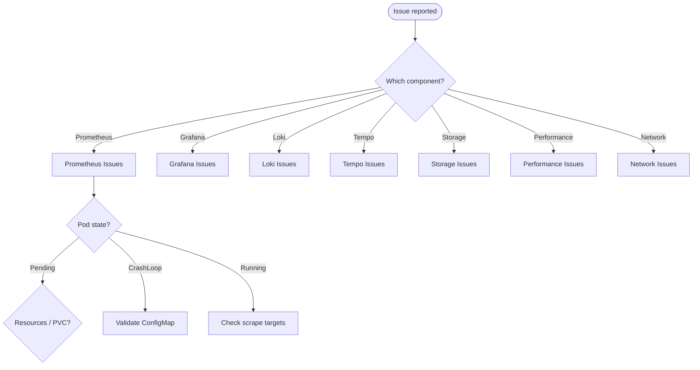
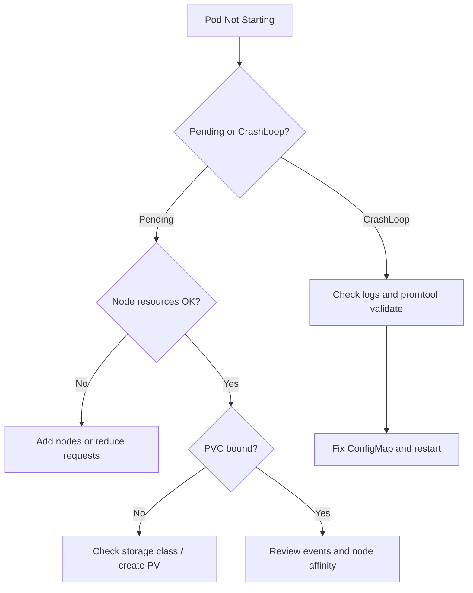

# Troubleshooting Guide

Common issues and their solutions for the observability stack.

## Table of Contents

- [Prometheus Issues](#prometheus-issues)
- [Grafana Issues](#grafana-issues)
- [Loki Issues](#loki-issues)
- [Tempo Issues](#tempo-issues)
- [Storage Issues](#storage-issues)
- [Performance Issues](#performance-issues)
- [Network Issues](#network-issues)

## Troubleshooting Overview



## Prometheus Issues

### Prometheus Pod Not Starting

**Symptoms**: Pod stuck in `Pending` or `CrashLoopBackOff`



**Diagnosis**:
```bash
kubectl describe pod prometheus-0 -n observability
kubectl logs prometheus-0 -n observability
```

**Common Causes & Solutions**:

1. **Insufficient Resources**
```bash
# Check node resources
kubectl top nodes

# Solution: Add more nodes or reduce resource requests
helm upgrade observability ./helm/observability \
  --set prometheus.resources.requests.memory=1Gi
```

2. **PVC Not Bound**
```bash
# Check PVC status
kubectl get pvc -n observability

# Solution: Check storage class or create PV manually
kubectl describe pvc prometheus-data-prometheus-0 -n observability
```

3. **Config Error**
```bash
# Validate config
kubectl exec -it prometheus-0 -n observability -- \
  promtool check config /etc/prometheus/prometheus.yml

# Solution: Fix configuration in ConfigMap
kubectl edit configmap prometheus-config -n observability
```

### Prometheus Target Down

**Symptoms**: Targets showing as `DOWN` in Prometheus UI

**Diagnosis**:
```bash
# Check target status
kubectl port-forward -n observability svc/prometheus 9090:9090
# Visit http://localhost:9090/targets

# Check if endpoint exists
kubectl get endpoints -n observability
```

**Solutions**:

1. **Service Discovery Issue**
```bash
# Verify service labels match
kubectl get svc <service-name> -o yaml

# Check ServiceMonitor configuration
kubectl get servicemonitor -n observability
```

2. **Network Policy Blocking**
```bash
# Check network policies
kubectl get networkpolicies -n observability

# Test connectivity
kubectl run -it --rm debug --image=busybox -n observability -- sh
wget -O- http://<service>:<port>/metrics
```

### High Memory Usage

**Symptoms**: Prometheus using excessive memory, OOMKilled

**Diagnosis**:
```bash
# Check memory usage
kubectl top pod prometheus-0 -n observability

# Check TSDB stats
curl http://localhost:9090/api/v1/status/tsdb
```

**Solutions**:

1. **Reduce Retention**
```bash
helm upgrade observability ./helm/observability \
  --set prometheus.retention=7d \
  --reuse-values
```

2. **Reduce Cardinality**
```yaml
# Add metric_relabel_configs to drop high-cardinality labels
- source_labels: [__name__]
  regex: 'high_cardinality_metric.*'
  action: drop
```

3. **Add Recording Rules**
```yaml
# Pre-aggregate expensive queries
- record: job:http_requests:rate5m
  expr: sum(rate(http_requests_total[5m])) by (job)
```

### Scrape Timeout

**Symptoms**: Metrics intermittently missing

**Diagnosis**:
```bash
# Check Prometheus logs
kubectl logs prometheus-0 -n observability | grep timeout
```

**Solutions**:

1. **Increase Timeout**
```yaml
# In prometheus.yml
scrape_configs:
- job_name: 'my-app'
  scrape_timeout: 30s  # Increase from default 10s
```

2. **Optimize Application Metrics**
```python
# Reduce metric collection time
# Cache expensive calculations
# Reduce metric cardinality
```

## Grafana Issues

### Cannot Login to Grafana

**Symptoms**: Login fails with default credentials

**Diagnosis**:
```bash
# Check credentials
kubectl get secret grafana-credentials -n observability -o yaml
echo "<base64-password>" | base64 -d
```

**Solutions**:

1. **Reset Password**
```bash
kubectl exec -it deployment/grafana -n observability -- \
  grafana-cli admin reset-admin-password newpassword
```

2. **Check Environment Variables**
```bash
kubectl exec deployment/grafana -n observability -- env | grep GF_
```

### Datasource Connection Failed

**Symptoms**: "Error connecting to datasource" in Grafana

**Diagnosis**:
```bash
# Check if Prometheus is accessible from Grafana pod
kubectl exec -it deployment/grafana -n observability -- \
  wget -O- http://prometheus:9090/-/healthy
```

**Solutions**:

1. **Verify Service Name**
```bash
# Check service exists
kubectl get svc prometheus -n observability

# Update datasource URL if needed
kubectl edit configmap grafana-datasources -n observability
```

2. **Check Network Policy**
```bash
# Ensure Grafana can reach Prometheus
kubectl get networkpolicies -n observability
```

### Dashboard Not Loading

**Symptoms**: Blank dashboard or "Panel plugin not found"

**Solutions**:

1. **Install Missing Plugins**
```bash
kubectl set env deployment/grafana -n observability \
  GF_INSTALL_PLUGINS="grafana-piechart-panel,grafana-clock-panel"

kubectl rollout restart deployment/grafana -n observability
```

2. **Check Dashboard JSON**
```bash
# Validate dashboard JSON
kubectl get configmap grafana-dashboards -n observability -o yaml
```

### High Memory Usage

**Symptoms**: Grafana pod OOMKilled

**Solutions**:
```bash
# Increase memory limits
helm upgrade observability ./helm/observability \
  --set grafana.resources.limits.memory=2Gi \
  --reuse-values

# Reduce concurrent queries
# Optimize dashboard queries
# Enable result caching
```

## Loki Issues

### Loki Not Receiving Logs

**Symptoms**: No logs in Grafana Explore

**Diagnosis**:
```bash
# Check Loki is running
kubectl get pods -l app=loki -n observability

# Check Promtail is running
kubectl get pods -l app=promtail -n observability

# Check Promtail logs
kubectl logs daemonset/promtail -n observability
```

**Solutions**:

1. **Verify Promtail Configuration**
```bash
kubectl exec -it daemonset/promtail -n observability -- \
  cat /etc/promtail/promtail.yaml

# Check targets
curl http://<promtail-pod-ip>:3101/targets
```

2. **Check Loki Ingestion**
```bash
# Port forward to Loki
kubectl port-forward -n observability svc/loki 3100:3100

# Check ready
curl http://localhost:3100/ready

# Check metrics
curl http://localhost:3100/metrics | grep loki_ingester
```

3. **File Permissions**
```bash
# Promtail needs access to /var/log/pods
# Check security context and volume mounts
kubectl describe daemonset promtail -n observability
```

### Query Performance Issues

**Symptoms**: LogQL queries timing out

**Solutions**:

1. **Add Time Range**
```logql
# Always specify time range
{app="my-app"} [5m]  # Instead of querying all time
```

2. **Use Label Filters**
```logql
# Filter early
{namespace="production", app="my-app"} |= "error"
```

3. **Increase Query Limits**
```yaml
# In Loki config
limits_config:
  max_entries_limit_per_query: 10000
  max_query_length: 721h
```

### High Memory Usage

**Symptoms**: Loki pod OOMKilled

**Solutions**:
```bash
# Increase memory
helm upgrade observability ./helm/observability \
  --set loki.resources.limits.memory=6Gi \
  --reuse-values

# Reduce retention
helm upgrade observability ./helm/observability \
  --set loki.retention=168h \
  --reuse-values

# Enable compression
# Configure chunk size appropriately
```

## Tempo Issues

### Traces Not Appearing

**Symptoms**: No traces in Grafana

**Diagnosis**:
```bash
# Check Tempo is running
kubectl get pods -l app=tempo -n observability

# Check Tempo logs
kubectl logs statefulset/tempo -n observability

# Verify receivers are listening
kubectl exec -it tempo-0 -n observability -- netstat -ln | grep -E '(4317|4318|14250|14268)'
```

**Solutions**:

1. **Verify Application Configuration**
```python
# Ensure app is sending to correct endpoint
otlp_exporter = OTLPSpanExporter(
    endpoint="http://tempo.observability.svc.cluster.local:4317",
    insecure=True
)
```

2. **Check Service**
```bash
kubectl get svc tempo -n observability

# Test connectivity from application pod
kubectl exec -it <app-pod> -- nc -zv tempo.observability.svc.cluster.local 4317
```

3. **Enable Debugging**
```bash
# Check Tempo metrics
kubectl port-forward -n observability svc/tempo 3200:3200
curl http://localhost:3200/metrics | grep tempo_ingester
```

## Storage Issues

### PVC Pending

**Symptoms**: PVC stuck in `Pending` state

**Diagnosis**:
```bash
kubectl describe pvc <pvc-name> -n observability
```

**Solutions**:

1. **No Storage Class**
```bash
# List available storage classes
kubectl get storageclass

# Set default storage class
kubectl patch storageclass <class-name> \
  -p '{"metadata": {"annotations":{"storageclass.kubernetes.io/is-default-class":"true"}}}'
```

2. **Insufficient Resources**
```bash
# Check available PVs
kubectl get pv

# Create PV manually or provision through cloud provider
```

### Disk Full

**Symptoms**: "no space left on device" errors

**Solutions**:

1. **Expand PVC**
```bash
# Edit PVC (if storage class allows expansion)
kubectl edit pvc prometheus-data-prometheus-0 -n observability

# Update size
spec:
  resources:
    requests:
      storage: 100Gi

# Restart pod for expansion to take effect
kubectl delete pod prometheus-0 -n observability
```

2. **Reduce Retention**
```bash
# For Prometheus
helm upgrade observability ./helm/observability \
  --set prometheus.retention=7d \
  --reuse-values

# For Loki
helm upgrade observability ./helm/observability \
  --set loki.retention=168h \
  --reuse-values
```

3. **Clean Old Data**
```bash
# Prometheus - delete specific metrics
curl -X POST http://localhost:9090/api/v1/admin/tsdb/delete_series?match[]={__name__=~"unused_metric.*"}
```

## Performance Issues

### Slow Queries

**Symptoms**: Dashboard loading slowly

**Solutions**:

1. **Optimize PromQL**
```promql
# Bad - high cardinality
sum(rate(http_requests_total[5m])) by (path)

# Good - aggregate first
sum(rate(http_requests_total[5m])) by (code, method)
```

2. **Use Recording Rules**
```yaml
- record: job:http_requests:rate5m
  expr: sum(rate(http_requests_total[5m])) by (job)
```

3. **Reduce Time Range**
```promql
# Query smaller time ranges
# Use appropriate step size
```

### High CPU Usage

**Symptoms**: Components using excessive CPU

**Solutions**:
```bash
# Identify bottleneck
kubectl top pods -n observability

# For Prometheus - reduce scrape frequency
# For Grafana - optimize dashboards
# For Loki - optimize queries and ingestion rate
```

## Network Issues

### Service Not Accessible

**Symptoms**: Cannot reach service

**Diagnosis**:
```bash
# Check service
kubectl get svc -n observability

# Check endpoints
kubectl get endpoints <service-name> -n observability

# Test from debug pod
kubectl run -it --rm debug --image=busybox -n observability -- sh
wget -O- http://<service>:<port>
```

**Solutions**:

1. **Check Labels**
```bash
# Ensure pod labels match service selector
kubectl get pods --show-labels -n observability
kubectl get svc <service-name> -n observability -o yaml | grep selector
```

2. **Check Network Policy**
```bash
kubectl get networkpolicies -n observability
kubectl describe networkpolicy <policy-name> -n observability
```

### DNS Resolution Failing

**Symptoms**: "could not resolve host" errors

**Solutions**:
```bash
# Test DNS from pod
kubectl exec -it <pod> -n observability -- nslookup prometheus

# Check CoreDNS
kubectl get pods -n kube-system -l k8s-app=kube-dns

# Restart CoreDNS if needed
kubectl rollout restart deployment/coredns -n kube-system
```

## General Debugging Commands

```bash
# Check all resources
kubectl get all -n observability

# Check events
kubectl get events -n observability --sort-by='.lastTimestamp'

# Check resource usage
kubectl top pods -n observability
kubectl top nodes

# Check logs
kubectl logs <pod-name> -n observability --tail=100 -f

# Describe resource
kubectl describe <resource-type> <resource-name> -n observability

# Execute command in pod
kubectl exec -it <pod-name> -n observability -- sh

# Port forward
kubectl port-forward -n observability <pod-name> <local-port>:<pod-port>
```

## Getting Help

1. Check logs for specific error messages
2. Search GitHub issues
3. Check component documentation
4. Ask in community Slack channels
5. Contact internal support team

## Useful Links

- [Prometheus Troubleshooting](https://prometheus.io/docs/prometheus/latest/troubleshooting/)
- [Grafana Troubleshooting](https://grafana.com/docs/grafana/latest/troubleshooting/)
- [Loki Troubleshooting](https://grafana.com/docs/loki/latest/operations/troubleshooting/)
- [Kubernetes Debugging](https://kubernetes.io/docs/tasks/debug/)

