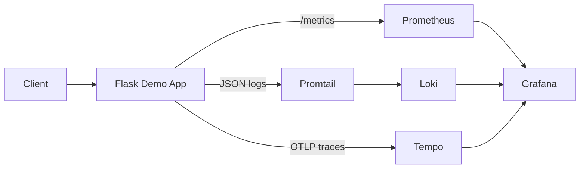

# Sample Instrumented Application

This is a fully instrumented Flask application demonstrating best practices for observability in Kubernetes.

## Features



- **Prometheus Metrics**: HTTP request counters, latency histograms, active request gauges
- **Structured Logging**: JSON formatted logs for Loki ingestion
- **OpenTelemetry Tracing**: Distributed tracing with Tempo integration
- **Multiple Endpoints**: Different scenarios for testing monitoring

## Building and Deploying

### Build Docker Image

```bash
cd examples/sample-app
docker build -t sample-app:latest .

# For cloud registries
docker tag sample-app:latest your-registry/sample-app:latest
docker push your-registry/sample-app:latest
```

### Deploy to Kubernetes

```bash
# Update image in deployment.yaml if using custom registry
kubectl apply -f deployment.yaml
```

### Verify Deployment

```bash
kubectl get pods -l app=sample-app
kubectl get svc sample-app
```

## Testing

### Generate Traffic

```bash
# Inside cluster
kubectl run -it --rm load-test --image=busybox --restart=Never -- sh -c \
  'while true; do wget -q -O- http://sample-app/api/users; sleep 1; done'

# From local machine (with port-forward)
kubectl port-forward svc/sample-app 8080:80

# Then run
while true; do curl http://localhost:8080/api/users; sleep 1; done
```

### Test Different Endpoints

```bash
# Normal endpoint
curl http://localhost:8080/api/users

# Specific user
curl http://localhost:8080/api/users/123

# Slow endpoint (2 second delay)
curl http://localhost:8080/api/slow

# Error endpoint (70% error rate)
curl http://localhost:8080/api/error

# Health check
curl http://localhost:8080/health

# Metrics
curl http://localhost:8080/metrics
```

## Observability Features

### Metrics Available

| Metric | Type | Description |
|--------|------|-------------|
| `http_requests_total` | Counter | Total HTTP requests by method, endpoint, status |
| `http_request_duration_seconds` | Histogram | Request duration by method, endpoint |
| `http_requests_active` | Gauge | Current active requests |
| `http_errors_total` | Counter | Total errors by type |

### Log Fields

All logs are JSON formatted with:
- `timestamp`: ISO 8601 timestamp
- `level`: Log level (INFO, WARNING, ERROR)
- `message`: Log message
- `service`: Service name
- `environment`: Deployment environment
- `user_id`: User ID (when applicable)
- `endpoint`: API endpoint
- `error`: Error details (for errors)

### Traces

Traces include:
- Span per API endpoint
- Nested spans for database queries
- Error information when exceptions occur
- Correlation with logs via trace ID

## Viewing in Observability Stack

### In Prometheus

1. Port forward: `kubectl port-forward -n observability svc/prometheus 9090:9090`
2. Visit http://localhost:9090
3. Query examples:
   ```promql
   # Request rate
   rate(http_requests_total[5m])
   
   # Error rate
   rate(http_requests_total{status="500"}[5m])
   
   # P95 latency
   histogram_quantile(0.95, rate(http_request_duration_seconds_bucket[5m]))
   ```

### In Grafana

1. Port forward: `kubectl port-forward -n observability svc/grafana 3000:3000`
2. Visit http://localhost:3000 (admin/admin)
3. Create dashboard with queries:
   - Request rate by endpoint
   - Error rate
   - Latency percentiles
   - Active connections

### In Loki

1. Open Grafana → Explore
2. Select Loki datasource
3. Query examples:
   ```logql
   # All logs from sample-app
   {app="sample-app"}
   
   # Only errors
   {app="sample-app"} |= "ERROR"
   
   # Parse JSON and filter
   {app="sample-app"} | json | level="error"
   
   # Rate of errors
   rate({app="sample-app"} |= "error" [5m])
   ```

### In Tempo

1. Open Grafana → Explore
2. Select Tempo datasource
3. Search traces:
   - By service name: `sample-app`
   - By duration: `> 1s`
   - By status: `status=error`

## Application Code Breakdown

### Metrics Setup

```python
from prometheus_client import Counter, Histogram, Gauge

REQUEST_COUNT = Counter(
    'http_requests_total',
    'Total HTTP requests',
    ['method', 'endpoint', 'status']
)
```

### Structured Logging

```python
class JSONFormatter(logging.Formatter):
    def format(self, record):
        return json.dumps({
            'timestamp': self.formatTime(record),
            'level': record.levelname,
            'message': record.getMessage(),
            # ... more fields
        })
```

### Tracing Setup

```python
from opentelemetry import trace
from opentelemetry.exporter.otlp.proto.grpc.trace_exporter import OTLPSpanExporter

tracer = trace.get_tracer(__name__)

with tracer.start_as_current_span("operation_name"):
    # Your code here
    pass
```

## Customization

### Adding Custom Metrics

```python
CUSTOM_METRIC = Gauge('custom_metric', 'Description', ['label1', 'label2'])
CUSTOM_METRIC.labels(label1='value1', label2='value2').set(42)
```

### Adding Custom Log Fields

```python
logger.info("Message", extra={
    'custom_field': 'value',
    'another_field': 123
})
```

### Adding Span Attributes

```python
with tracer.start_as_current_span("span_name") as span:
    span.set_attribute("custom_attribute", "value")
    span.set_attribute("user_id", 123)
```

## Troubleshooting

### Metrics Not Appearing

```bash
# Check if metrics endpoint works
kubectl port-forward pod/<pod-name> 8000:8000
curl http://localhost:8000/metrics

# Check ServiceMonitor
kubectl get servicemonitor sample-app -o yaml
```

### Logs Not in Loki

```bash
# Check pod logs are being written
kubectl logs -l app=sample-app

# Check Promtail is collecting
kubectl logs -l app=promtail -n observability | grep sample-app
```

### Traces Not in Tempo

```bash
# Check Tempo endpoint is accessible
kubectl exec -it <sample-app-pod> -- nc -zv tempo.observability.svc.cluster.local 4317

# Check application logs for trace errors
kubectl logs -l app=sample-app | grep -i trace
```

## Best Practices Demonstrated

1. ✅ Expose metrics on separate port (:8000)
2. ✅ Use structured JSON logging
3. ✅ Instrument all API endpoints
4. ✅ Add business-relevant labels to metrics
5. ✅ Create nested spans for detailed tracing
6. ✅ Log with appropriate levels (INFO, WARNING, ERROR)
7. ✅ Include context in logs and traces
8. ✅ Handle errors gracefully with proper instrumentation
9. ✅ Use histograms for latency measurements
10. ✅ Track active requests with gauges

## Further Reading

- [Prometheus Best Practices](https://prometheus.io/docs/practices/)
- [OpenTelemetry Python](https://opentelemetry.io/docs/instrumentation/python/)
- [Grafana Loki LogQL](https://grafana.com/docs/loki/latest/logql/)

